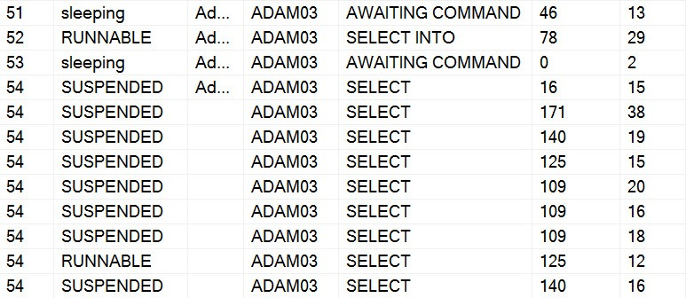
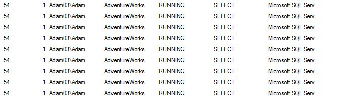

# sp_whoisactive: A Brief History of Activity Monitoring

------
[Home](https://github.com/amachanic/sp_whoisactive)	[Download](https://github.com/amachanic/sp_whoisactive/archive/master.zip)	[Documentation Index](ReadMe.md)
------
Next: [Design Philosophy](02_design.md)
------

"Hey DBA! Why is the application so slow?"

"Hey DBA! Why is my query taking, like, forever to return the results?"

"Hey DBA! Something is broken! Fix it, quick!"

If you've been a DBA for 10 minutes or more, you've no doubt heard all of the above statements and every possible transformation of the above statements. A big part of every DBA's job is to understand what's going on when things misbehave. And real-time activity monitoring plays a big part in the quest for insight: if something is broken right now, we need to understand exactly what components are malfunctioning and use that data to quickly make decisions about which course of action to take. **The worst thing a DBA can do is to base a decision on an uninformed guess**.

In order to avoid guesswork, a monitoring solution must provide plenty of data. Data about the component that's malfunctioning, data about what else is running on the system, and if possible contextual data to help the DBA understand how the system got into the state it's in. That's a lot of data, and over the course of the history of SQL Server the level of availability for this kind of information has ranged from totally unexposed (SQL Server 2000 and earlier) to exposed but difficult to access (SQL Server 2005 and beyond).

### SQL Server 7.0 and SQL Server 2000: Squinting Through the Fog

Back in the bad old days of Enterprise Manager, if you wanted to know what was running on your instance you could right-click and select "Current Activity." If Enterprise Manager didn't lock up or take some other completely unpredictable route, the user was rewarded with a list of server processes identifiers, a terse column called "command" that gave a very general indication of what each of those processes was up to, and some basic metrics--CPU, reads, writes, etc--that were known to be woefully inaccurate in most cases.

More advanced users quickly learned to avoid Enterprise Manager altogether. The same information could be gleaned within Query Analyzer by using the sp_who or sp_who2 procedures, or by querying the sysprocesses view. While using Query Analyzer made data collection faster than it was from the Enterprise Manager user interface, the information was still of the same level of quality--or lack thereof. The screen shot below illustrates the state of the art information shown by these tools. **Session 54 seems to be kind of busy**, I guess? I wonder what it’s up to? Well, since I have no clue and the server is slow, **I should probably just kill it.**

Users who were geeky enough to read internals books knew how to get just a bit more information about what the offending session was doing—sort of. The DBCC INPUTBUFFER command would return information about the most recent SQL batch that had been submitted to the server on behalf of the request. This is much better than simply seeing that session 54 is doing some kind of select, but it’s also quite limiting. The SQL submitted might have been a non-parameterized ad hoc batch, in which case seeing what was happening was easy. But as more and more developers learned to use stored procedures, DBCC INPUTBUFFER often returned something as simple as “EXEC SomeStoredProcedure” – and if the procedure had been called via RPC, it wasn’t even possible to see the parameters that were passed in. (And, I should add, it’s still not possible now. A lot has changed in 13 years, but not enough.)

In order to gain more visibility into what was going on on the server, **many DBAs forgot about these commands altogether** and employed another tool that shipped with SQL Server: Profiler. Most of the DBAs I worked with in the late '90s and early '00s kept Profiler open and attached to the various production instances, all day long. Various information would constantly scroll by and, if there was a problem, the stream could be stopped and the DBA could scroll up and down and try to figure out exactly what the situation was. This technique had its plusses and minuses, to be certain: Profiler showed a lot more information—enough to actually figure out the problem in many cases. But it also showed a lot more information—enough to be overwhelming in many cases. And then there was the fact that Profiler could slow down your entire instance of SQL Server. Which was especially problematic when a whole team of DBAs were all working on the same server, and all had Profiler attached and streaming information.

### SQL Server 2005: Information Overload

Clearly, the monitoring situation in SQL Server 2000 was pretty bad. And luckily, Microsoft got the memo. SQL Server 2005 shipped with a set of new monitoring objects called Dynamic Management Views (DMVs). These objects returned a huge amount of information that had never been available in the SQL Server 2000 system views. Many situations that had previously been possible to debug only by getting information from Profiler or a server-side trace were suddenly possible to deal with by running a few SQL queries. The only problem was that for a long time, **no one seemed to know exactly how to write the correct queries**. With scores of DMVs, each with scores of columns, things were overwhelming, and busy DBAs simply didn’t have the time to properly adapt.

Even Microsoft didn’t seem to be able to leverage these powerful new views. The screen shot below is from SQL Server 2008’s Activity Monitor. The 2008 UI is a lot sharper than the SQL Server 2000 Current Activity UI, and more data is returned by Activity Monitor, but the situation is basically the same as it ever was. **Session 54 is still chugging away, doing, well... something.**

To be fair, I can now right-click on any of these rows and find out what SQL is being run by this session. But the user experience is still not even close to user-friendly, and Activity Monitor has a large number of bugs and strange behaviors. Why does it auto-refresh every five seconds? What if I was looking at something? And why do I see a million rows for session 54? There was only one request, wasn’t there?

Even today, in 2011, **many DBAs I talk to are still using sp_who and sp_who2**. A lot of them are still relying on streaming information from SQL Server Profiler. And while people have finally learned to leverage the DMVs, they often use small, standalone ad hoc scripts and query one or two DMVs to find a very specific bit of information. We’ve progressed from a situation where there is not enough information, to a situation where there are too many places to go for the information that really matters. A lateral move at best.

### A Personal Journey

In 2007 I decided to get serious about the DMVs, and I began working on a script to help with monitoring. The first version was posted to my blog on December 31, 2007.

Now, years later, I have taken that script through countless iterations and I’ve learned a tremendous amount about the various DMVs along the way. The [Who is Active](https://github.com/amachanic/sp_whoisactive/releases) stored procedure correlates a large amount of data from 15 of the DMVs, to allow DBAs to get a complete picture when doing real-time activity monitoring. Although my stored procedure has been well-received and is designed to make it easy to get information from the DMVs, it has a large number of options and a few quirks. So it's no surprise that **I have received numerous requests for in-depth documentation**. That’s the point of this blog series: Over the course of the month I will take you through every corner of Who is Active. I will explain how I use it to do troubleshooting on a daily basis, and I'll give you some insight into how it works and why.

------
Next: [Design Philosophy](02_design.md)
------
