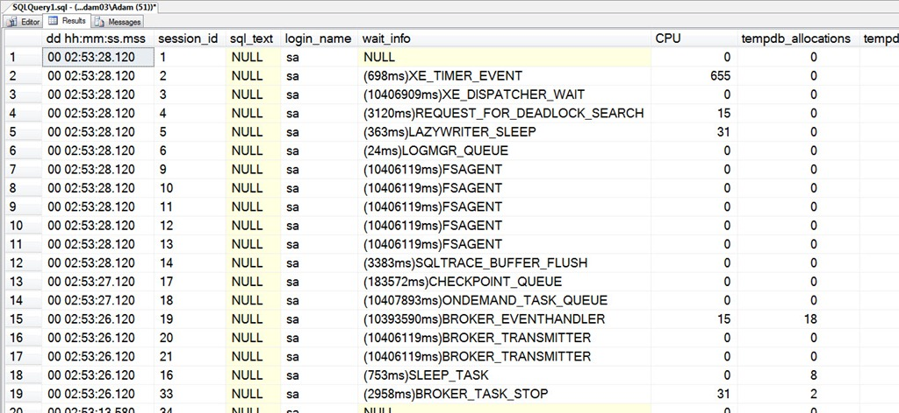

# sp_whoisactive: Less Data is More Data

------
[Home](https://github.com/amachanic/sp_whoisactive)	[Download](https://github.com/amachanic/sp_whoisactive/archive/master.zip)	[Documentation Index](ReadMe.md)
------
Prior: [Installing sp_whoisactive](04_installation.md)	Next: [Options](06_options.md)
------

#### You’ve downloaded Who is Active for the first time.

You’ve unzipped it.

You’ve taken a quick peek through the code to make sure I didn’t send you a rejuvenated version of Slammer.

**You’ve installed it on a test server** so that you can make sure it won’t take down your production environment. (Always a good idea.)

And now, the moment of truth arrives. You fire up SSMS and—hands ever-so-slightly shaking, breath held, body quaking with anticipation—you type the following:

```sql
EXEC sp_WhoIsActive
```

Your hand slowly approaches the F5 key. Your heart racing, you slowly depress the plastic square and...


#### Nothing at all. Where are the results? Is this thing broken? Um, hello?!

Unfortunately, this is apparently a common scenario for new Who is Active users. (The empty result set. The rest? Well, who knows.) I have received many e-mails and blog comments from people asking why this large, complex stored procedure they’ve just downloaded doesn’t seem to actually do anything when they run it.

The answer is simple: **It didn’t show you any information because there was nothing interesting to show you**. Unlike sp_who, sp_who2, and most of their brethren, Who is Active—by default—only shows you the sessions that you’re likely to want to see. If you installed it on a test server, or your laptop, or some other non-production machine, you’re probably not going to see any output in the default mode because there is nothing to show you. There are no active requests, and no one has started a transaction and left it sitting around waiting for Who is Active to drop by and monitor. **The lack of output in this case is a good thing**. It means that you don’t have to waste your time trying to find the meaningful information in a sea of worthless data. [I explained this previously in the article on design philosophy](02_design.md).

#### Seeing More Data – The Basics

Sometimes you actually do want to see all of the data that Who is Active hides by default. One such time is when you’ve first installed Who is Active and want to get comfortable with it. No problem; if you’d like it to return one row for every session (and more than one row for some sessions, if they’re using Multiple Active Result Sets), you have to work with three options:

```sql
EXEC sp_WhoIsActive
    @show_sleeping_spids = 2,
    @show_system_spids = 1,
    @show_own_spid = 1
```

Once you’ve done that, the output will look much closer to what you’re probably used to seeing.



The three options shown above will be covered in detail in a future post, but in brief, here’s what we’ve done:
- Changed the default mode from showing only active requests and/or sessions with open transactions to showing all connected sessions
- Changed the default mode from hiding system sessions (even if they fall into the above category) to showing system sessions
- Changed the default mode from hiding your own session—the one calling Who is Active—to showing it along with the rest of the output

**Many people are uncomfortable, at first, with how little output they see when they run Who is Active**. My recommendation: Try to let go of the need to see everything that’s connected to your SQL Server instances. There’s simply not enough time in the day to bother with that level of detail.

------
Prior: [Installing sp_whoisactive](04_installation.md)	Next: [Options](06_options.md)
------
