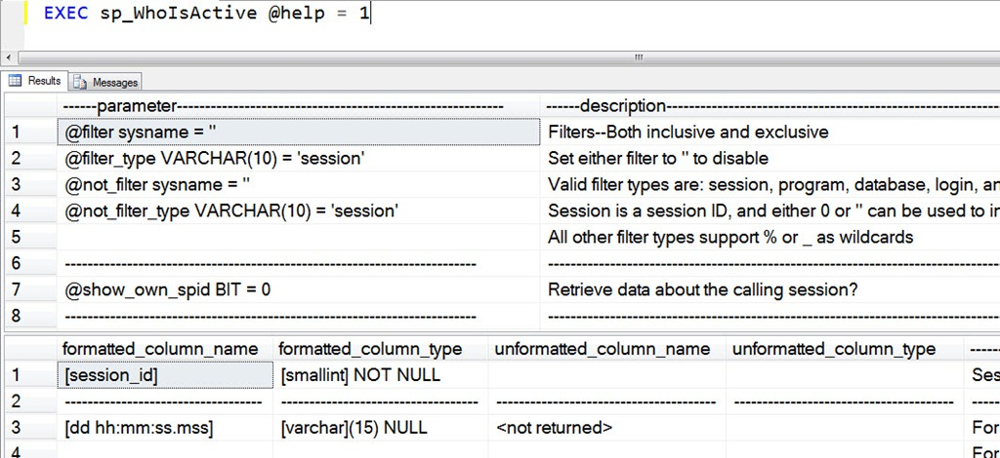

# sp_whoisactive: Options

------
[Home](https://github.com/amachanic/sp_whoisactive)	[Download](https://github.com/amachanic/sp_whoisactive/archive/master.zip)	[Documentation Index](ReadMe.md)
------
Prior: [Less Data is More Data](05_lessdata.md)	Next: [Default Columns](07_default.md)
------

### What fun would life be without lots of choices?

Activity monitoring, like life, is much more fun (and effective) when you can pick and choose from a variety of options. And the opposite is true: a lack of options makes for a dull, ineffective, one-trick solution. Case in point? sp_who and sp_who2 had only one parameter each. The super-dull "@loginame [sic]." Yes, those crazy kids at Microsoft left out an "n," but it's not like the parameter was well-named. After all, it wasn't just a filter on a login name; it could also be a SPID, or it could be the word "active," which would make it show all sessions that weren't sleeping (including system sessions). Thanks for the straightforward user experience, Microsoft!

Unlike its predecessors, Who is Active gives you plenty of options with which to work. The procedure has 24 parameters as of the time of this writing; here they are, with their default values:

```sql
@filter sysname = ''
@filter_type VARCHAR(10) = 'session'
@not_filter sysname = ''
@not_filter_type VARCHAR(10) = 'session'
@show_own_spid BIT = 0
@show_system_spids BIT = 0
@show_sleeping_spids TINYINT = 1
@get_full_inner_text BIT = 0
@get_plans TINYINT = 0
@get_outer_command BIT = 0
@get_transaction_info BIT = 0
@get_task_info TINYINT = 1
@get_locks BIT = 0
@get_avg_time BIT = 0
@get_additional_info BIT = 0
@find_block_leaders BIT = 0
@delta_interval TINYINT = 0
@output_column_list VARCHAR(8000) = '[dd%][session_id][sql_text][sql_command][login_name][wait_info][tasks][tran_log%][cpu%][temp%][block%][reads%][writes%][context%][physical%][query_plan][locks][%]'
@sort_order VARCHAR(500) = '[start_time] ASC'
@format_output TINYINT = 1
@destination_table VARCHAR(4000) = ''
@return_schema BIT = 0
@schema VARCHAR(MAX) = NULL OUTPUT
@help BIT = 0
```


#### Parameter Details

| Parameter Name | Description |
|-|-|
| @filter sysname = ''<br>@filter_type VARCHAR(10) = 'session'<br>@not_filter sysname = ''<br>@not_filter_type VARCHAR(10) = 'session'<br> | Filters--Both inclusive and exclusive<br>Set either filter to '' to disable<br>Valid filter types are: session, program, database, login, and host<br>Session is a session ID, and either 0 or '' can be used to indicate "all" sessions<br>All other filter types support % or _ as wildcards |
| @show_own_spid BIT = 0 | Retrieve data about the calling session? |
| @show_system_spids BIT = 0 | Retrieve data about system sessions? |
| @show_sleeping_spids TINYINT = 1<br><br><br> | Controls how sleeping SPIDs are handled, based on the idea of levels of interest<br>0 does not pull any sleeping SPIDs<br>1 pulls only those sleeping SPIDs that also have an open transaction<br>2 pulls all sleeping SPIDs |
| @get_full_inner_text BIT = 0<br> | If 1, gets the full stored procedure or running batch, when available<br>If 0, gets only the actual statement that is currently running in the batch or procedure |
| @get_plans TINYINT = 0<br><br> | Get associated query plans for running tasks, if available<br>If @get_plans = 1, gets the plan based on the request's statement offset<br>If @get_plans = 2, gets the entire plan based on the request's plan_handle |
| @get_outer_command BIT = 0 | Get the associated outer ad hoc query or stored procedure call, if available |
| @get_transaction_info BIT = 0 | Enables pulling transaction log write info and transaction duration |
| @get_task_info TINYINT = 1<br><br><br><br> | Get information on active tasks, based on three interest levels<br>Level 0 does not pull any task-related information<br>Level 1 is a lightweight mode that pulls the top non-CXPACKET wait, giving preference to blockers<br>Level 2 pulls all available task-based metrics, including:<br>number of active tasks, current wait stats, physical I/O, context switches, and blocker information |
| @get_locks BIT = 0 | Gets associated locks for each request, aggregated in an XML format |
| @get_avg_time BIT = 0<br> | Get average time for past runs of an active query<br>(based on the combination of plan handle, sql handle, and offset) |
| @get_additional_info BIT = 0<br><br><br><br><br><br><br><br> | Get additional non-performance-related information about the session or request<br>text_size, language, date_format, date_first, quoted_identifier, arithabort, ansi_null_dflt_on,<br>ansi_defaults, ansi_warnings, ansi_padding, ansi_nulls, concat_null_yields_null,<br>transaction_isolation_level, lock_timeout, deadlock_priority, row_count, command_type<br><br>If a SQL Agent job is running, an subnode called agent_info will be populated with some or all of<br>the following: job_id, job_name, step_id, step_name, msdb_query_error (in the event of an error)<br><br>If @get_task_info is set to 2 and a lock wait is detected, a subnode called block_info will be<br>populated with some or all of the following: lock_type, database_name, object_id, file_id, hobt_id,<br>applock_hash, metadata_resource, metadata_class_id, object_name, schema_name |
| @find_block_leaders BIT = 0<br><br> | Walk the blocking chain and count the number of<br>total SPIDs blocked all the way down by a given session<br>Also enables task_info Level 1, if @get_task_info is set to 0 |
| @delta_interval TINYINT = 0<br> | Pull deltas on various metrics<br>Interval in seconds to wait before doing the second data pull |
| @output_column_list VARCHAR(8000) = '[dd%][session_id][sql_text][sql_command][login_name][wait_info][tasks][tran_log%][cpu%][temp%][block%][reads%][writes%][context%][physical%][query_plan][locks][%]'<br><br><br><br><br><br><br> | List of desired output columns, in desired order<br>Note that the final output will be the intersection of all enabled features and all<br>columns in the list. Therefore, only columns associated with enabled features will<br>actually appear in the output. Likewise, removing columns from this list may effectively<br>disable features, even if they are turned on<br><br>Each element in this list must be one of the valid output column names. Names must be<br>delimited by square brackets. White space, formatting, and additional characters are<br>allowed, as long as the list contains exact matches of delimited valid column names. |
| @sort_order VARCHAR(500) = '[start_time] ASC'<br><br><br><br><br><br><br><br><br> | Column(s) by which to sort output, optionally with sort directions.<br>Valid column choices:<br>session_id, physical_io, reads, physical_reads, writes, tempdb_allocations,<br>tempdb_current, CPU, context_switches, used_memory, physical_io_delta, reads_delta,<br>physical_reads_delta, writes_delta, tempdb_allocations_delta, tempdb_current_delta,<br>CPU_delta, context_switches_delta, used_memory_delta, tasks, tran_start_time,<br>open_tran_count, blocking_session_id, blocked_session_count, percent_complete,<br>host_name, login_name, database_name, start_time, login_time, program_name<br><br>Note that column names in the list must be bracket-delimited. Commas and/or white<br>space are not required. |
| @format_output TINYINT = 1<br><br><br> | Formats some of the output columns in a more "human readable" form<br>0 disables outfput format<br>1 formats the output for variable-width fonts<br>2 formats the output for fixed-width fonts |
| @destination_table VARCHAR(4000) = ''<br><br><br> | If set to a non-blank value, the script will attempt to insert into the specified<br>destination table. Please note that the script will not verify that the table exists,<br>or that it has the correct schema, before doing the insert.<br>Table can be specified in one, two, or three-part format |
| @return_schema BIT = 0<br>@schema VARCHAR(MAX) = NULL OUTPUT<br><br><br> | If set to 1, no data collection will happen and no result set will be returned; instead,<br>a CREATE TABLE statement will be returned via the @schema parameter, which will match<br>the schema of the result set that would be returned by using the same collection of the<br>rest of the parameters. The CREATE TABLE statement will have a placeholder token of<br><table_name> in place of an actual table name. |

#### Output Columns Detail

| formatted_column_name | formatted_column_type | unformatted_column_name | unformatted_column_type | description |
|-|-|-|-|-|
| [session_id] | [smallint] NOT NULL |  |  | Session ID (a.k.a. SPID) |
| [dd hh:mm:ss.mss]<br> | [varchar](15) NULL<br> | <not returned><br> | 0<br> | For an active request, time the query has been running<br>For a sleeping session, time since the last batch completed |
| [dd hh:mm:ss.mss (avg)]<br> | [varchar](15) NULL<br> | [avg_elapsed_time]<br> | [int] NULL<br> | (Requires @get_avg_time option)<br>How much time has the active portion of the query taken in the past, on average? |
| [physical_io] | [varchar](30) NULL | [physical_io] | [bigint] NULL | Shows the number of physical I/Os, for active requests |
| [reads]<br> | [varchar](30) NULL<br> | [reads]<br> | [bigint] NULL<br> | For an active request, number of reads done for the current query<br>For a sleeping session, total number of reads done over the lifetime of the session |
| [physical_reads]<br> | [varchar](30) NULL<br> | [physical_reads]<br> | [bigint] NULL<br> | For an active request, number of physical reads done for the current query<br>For a sleeping session, total number of physical reads done over the lifetime of the session |
| [writes]<br> | [varchar](30) NULL<br> | [writes]<br> | [bigint] NULL<br> | For an active request, number of writes done for the current query<br>For a sleeping session, total number of writes done over the lifetime of the session |
| [tempdb_allocations]<br> | [varchar](30) NULL<br> | [tempdb_allocations]<br> | [bigint] NULL<br> | For an active request, number of TempDB writes done for the current query<br>For a sleeping session, total number of TempDB writes done over the lifetime of the session |
| [tempdb_current]<br> | [varchar](30) NULL<br> | [tempdb_current]<br> | [bigint] NULL<br> | For an active request, number of TempDB pages currently allocated for the query<br>For a sleeping session, number of TempDB pages currently allocated for the session |
| [CPU]<br> | [varchar](30) NULL<br> | [CPU]<br> | [int] NULL<br> | For an active request, total CPU time consumed by the current query<br>For a sleeping session, total CPU time consumed over the lifetime of the session |
| [context_switches] | [varchar](30) NULL | [context_switches] | [bigint] NULL | Shows the number of context switches, for active requests |
| [used_memory]<br> | [varchar](30) NOT NULL<br> | [used_memory]<br> | [bigint] NOT NULL<br> | For an active request, total memory consumption for the current query<br>For a sleeping session, total current memory consumption |
| [physical_io_delta]<br><br> | [varchar](30) NULL<br><br> | [physical_io_delta]<br><br> | [bigint] NULL<br><br> | (Requires @delta_interval option)<br>Difference between the number of physical I/Os reported on the first and second collections.<br>If the request started after the first collection, the value will be NULL |
| [reads_delta]<br><br> | [varchar](30) NULL<br><br> | [reads_delta]<br><br> | [bigint] NULL<br><br> | (Requires @delta_interval option)<br>Difference between the number of reads reported on the first and second collections.<br>If the request started after the first collection, the value will be NULL |
| [physical_reads_delta]<br><br> | [varchar](30) NULL<br><br> | [physical_reads_delta]<br><br> | [bigint] NULL<br><br> | (Requires @delta_interval option)<br>Difference between the number of physical reads reported on the first and second collections.<br>If the request started after the first collection, the value will be NULL |
| [writes_delta]<br><br> | [varchar](30) NULL<br><br> | [writes_delta]<br><br> | [bigint] NULL<br><br> | (Requires @delta_interval option)<br>Difference between the number of writes reported on the first and second collections.<br>If the request started after the first collection, the value will be NULL |
| [tempdb_allocations_delta]<br><br> | [varchar](30) NULL<br><br> | [tempdb_allocations_delta]<br><br> | [bigint] NULL<br><br> | (Requires @delta_interval option)<br>Difference between the number of TempDB writes reported on the first and second collections.<br>If the request started after the first collection, the value will be NULL |
| [tempdb_current_delta]<br><br> | [varchar](30) NULL<br><br> | [tempdb_current_delta]<br><br> | [bigint] NULL<br><br> | (Requires @delta_interval option)<br>Difference between the number of allocated TempDB pages reported on the first and second<br>collections. If the request started after the first collection, the value will be NULL |
| [CPU_delta]<br><br> | [varchar](30) NULL<br><br> | [CPU_delta]<br><br> | [int] NULL<br><br> | (Requires @delta_interval option)<br>Difference between the CPU time reported on the first and second collections.<br>If the request started after the first collection, the value will be NULL |
| [context_switches_delta]<br><br> | [varchar](30) NULL<br><br> | [context_switches_delta]<br><br> | [bigint] NULL<br><br> | (Requires @delta_interval option)<br>Difference between the context switches count reported on the first and second collections<br>If the request started after the first collection, the value will be NULL |
| [used_memory_delta]<br> | [varchar](30) NULL<br> | [used_memory_delta]<br> | [bigint] NULL<br> | Difference between the memory usage reported on the first and second collections<br>If the request started after the first collection, the value will be NULL |
| [tasks] | [varchar](30) NULL | [tasks] | [smallint] NULL | Number of worker tasks currently allocated, for active requests |
| [status] | [varchar](30) NOT NULL | 0 | 0 | Activity status for the session (running, sleeping, etc) |
| [wait_info]<br><br><br><br><br><br><br><br> | [nvarchar](4000) NULL<br><br><br><br><br><br><br><br> | 0<br><br><br><br><br><br><br><br> | 0<br><br><br><br><br><br><br><br> | Aggregates wait information, in the following format:<br>(Ax: Bms/Cms/Dms)E<br>A is the number of waiting tasks currently waiting on resource type E. B/C/D are wait<br>times, in milliseconds. If only one thread is waiting, its wait time will be shown as B.<br>If two tasks are waiting, each of their wait times will be shown (B/C). If three or more<br>tasks are waiting, the minimum, average, and maximum wait times will be shown (B/C/D).<br>If wait type E is a page latch wait and the page is of a "special" type (e.g. PFS, GAM, SGAM),<br>the page type will be identified.<br>If wait type E is CXPACKET, the nodeId from the query plan will be identified |
| [locks]<br><br><br> | [xml] NULL<br><br><br> | 0<br><br><br> | 0<br><br><br> | (Requires @get_locks option)<br>Aggregates lock information, in XML format.<br>The lock XML includes the lock mode, locked object, and aggregates the number of requests.<br>Attempts are made to identify locked objects by name |
| [tran_start_time]<br><br> | [datetime] NULL<br><br> | 0<br><br> | 0<br><br> | (Requires @get_transaction_info option)<br>Date and time that the first transaction opened by a session caused a transaction log<br>write to occur. |
| [tran_log_writes]<br><br><br><br><br> | [nvarchar](4000) NULL<br><br><br><br><br> | 0<br><br><br><br><br> | 0<br><br><br><br><br> | (Requires @get_transaction_info option)<br>Aggregates transaction log write information, in the following format:<br>A:wB (C kB)<br>A is a database that has been touched by an active transaction<br>B is the number of log writes that have been made in the database as a result of the transaction<br>C is the number of log kilobytes consumed by the log records |
| [open_tran_count] | [varchar](30) NULL | [open_tran_count] | [smallint] NULL | Shows the number of open transactions the session has open |
| [sql_command]<br><br> | [xml] NULL<br><br> | [sql_command]<br><br> | [nvarchar]<br><br> | (Requires @get_outer_command option)<br>Shows the "outer" SQL command, i.e. the text of the batch or RPC sent to the server,<br>if available |
| [sql_text]<br><br><br><br><br><br><br> | [xml] NULL<br><br><br><br><br><br><br> | [sql_text]<br><br><br><br><br><br><br> | [nvarchar]<br><br><br><br><br><br><br> | Shows the SQL text for active requests or the last statement executed<br>for sleeping sessions, if available in either case.<br>If @get_full_inner_text option is set, shows the full text of the batch.<br>Otherwise, shows only the active statement within the batch.<br>If the query text is locked, a special timeout message will be sent, in the following format:<br><timeout_exceeded /><br>If an error occurs, an error message will be sent, in the following format:<br><error message="message" /> |
| [query_plan]<br><br><br><br><br> | [xml] NULL<br><br><br><br><br> | 0<br><br><br><br><br> | 0<br><br><br><br><br> | (Requires @get_plans option)<br>Shows the query plan for the request, if available.<br>If the plan is locked, a special timeout message will be sent, in the following format:<br><timeout_exceeded /><br>If an error occurs, an error message will be sent, in the following format:<br><error message="message" /> |
| [blocking_session_id] | [smallint] NULL | 0 | 0 | When applicable, shows the blocking SPID |
| [blocked_session_count]<br><br> | [varchar](30) NULL<br><br> | [blocked_session_count]<br><br> | [smallint] NULL<br><br> | (Requires @find_block_leaders option)<br>The total number of SPIDs blocked by this session,<br>all the way down the blocking chain. |
| [percent_complete] | [varchar](30) NULL | [percent_complete] | [real] NULL | When applicable, shows the percent complete (e.g. for backups, restores, and some rollbacks) |
| [host_name] | [sysname] NOT NULL | 0 | 0 | Shows the host name for the connection |
| [login_name] | [sysname] NOT NULL | 0 | 0 | Shows the login name for the connection |
| [database_name] | [sysname] NULL | 0 | 0 | Shows the connected database |
| [program_name] | [sysname] NULL | 0 | 0 | Shows the reported program/application name |
| [additional_info]<br><br><br> | [xml] NULL<br><br><br> | 0<br><br><br> | 0<br><br><br> | (Requires @get_additional_info option)<br>Returns additional non-performance-related session/request information<br>If the script finds a SQL Agent job running, the name of the job and job step will be reported<br>If @get_task_info = 2 and the script finds a lock wait, the locked object will be reported |
| [start_time]<br> | [datetime] NOT NULL<br> | 0<br> | 0<br> | For active requests, shows the time the request started<br>For sleeping sessions, shows the time the last batch completed |
| [login_time] | [datetime] NOT NULL | 0 | 0 | Shows the time that the session connected |
| [request_id]<br> | [int] NULL<br> | 0<br> | 0<br> | For active requests, shows the request_id<br>Should be 0 unless MARS is being used |
| [collection_time] | [datetime] NOT NULL |  |  | Time that this script's final SELECT ran |

I could write a few sentences about each option, but I've already done that. You can find short descriptions in the comment header I've included with Who is Active. But I don't want you to have to print that out, and neither should you be expected to memorize 24 parameters (at least, not right away). Instead of doing either of those things, **focus your attention on the most important parameter of all: the last one**.

@help, when set to 1, causes the procedure to return the same text found in the comment header, nicely formatted (well, sort of) in the SSMS results pane. Like this:



There are two results in the output: the first contains information about all of the available input parameters; the second contains information about all of the output columns.

Once you understand the options fairly well, you can use the help in another way, to set up your own custom script to call Who is Active. Select the first column (click the header that says “parameter”), and use CTRL-C and CTRL-V to copy and paste the text into a new window. Add a call to Who is Active, remove a few lines, pop in a few commas, and you’ll have something like this:

```sql
EXEC sp_WhoIsActive
    @filter = '',
    @filter_type = 'session',
    @not_filter = '',
    @not_filter_type = 'session',
    @show_own_spid = 0,
    @show_system_spids = 0,
    @show_sleeping_spids = 1,
    @get_full_inner_text = 0,
    @get_plans = 0,
    @get_outer_command = 0,
    @get_transaction_info = 0,
    @get_task_info = 1,
    @get_locks = 0,
    @get_avg_time = 0,
    @get_additional_info = 0,
    @find_block_leaders = 0,
    @delta_interval = 0,
    @output_column_list = '[dd%][session_id][sql_text][sql_command][login_name][wait_info][tasks][tran_log%][cpu%][temp%][block%][reads%][writes%][context%][physical%][query_plan][locks][%]',
    @sort_order = '[start_time] ASC',
    @format_output = 1,
    @destination_table = '',
    @return_schema = 0,
    @schema = NULL,
    @help = 0
```

Save this to a script, and you’ll be able to easily and quickly call the procedure using any of the parameter combinations you like, without having to type them all in every time. **It’s almost like intellisense that actually works!**

------
Prior: [Less Data is More Data](05_lessdata.md)	Next: [Default Columns](07_default.md)
------
