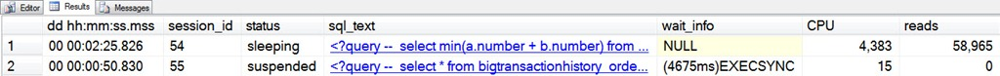
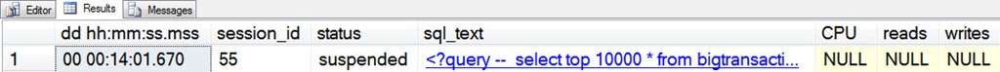

# sp_whoisactive: Active Request, Sleeping Session

------
[Home](https://github.com/amachanic/sp_whoisactive)	[Download](https://github.com/amachanic/sp_whoisactive/archive/master.zip)	[Documentation Index](ReadMe.md)
------
Prior: [Default Columns](07_default.md)	Next: [Deciding What \(Not\) To See](09_deciding.md)
------

### The life cycle of a connection can be represented by a few simple phases:

- Connect
- Query
- Sleep
- (Repeat query and sleep as needed)
- Disconnect

Who is Active, being a real-time activity monitoring tool, is designed to help track activity in those middle phases. The procedure doesn’t capture statistics about connections, and similarly it can’t report (very well) on anything that has already disconnected.

Most of the time—assuming that your workload is relatively normal—**the majority of the sessions that you'll see reported by Who is Active will be in the Query phase**. But due to open transactions, queries in the Sleep phase may also sneak in. And in some extreme cases, you might even see a query in the Disconnect phase. More on that in a bit.

So why does this matter? It all boils down to a simple question: How should session-level data be represented? The legacy sysprocesses view more or less mashed everything together. The execution context DMVs, on the other hand, split things up so that data from the Query phase is found in a request-level view, and aggregate data updated as soon as the Sleep phase begins, in a session-level view. My choices were, therefore, as follows:

- Mash everything together, like sysprocesses
- Treat sleeping sessions and active requests differently
- Create two columns for each metric: one for session-level data and another for request-level data

The first option was out before I even thought through the possibilities. As I mentioned [in the first post in this series](01_background.md), I find the quality of data reported by sysprocesses to be, well, lacking.

The third option seemed interesting, but one of my goals with Who is Active was to keep things [simple and easily digestible](02_design.md). Having a million columns kind of defeats that purpose.

So in the end, my only choice was the middle path: the **data from sleeping sessions and active requests is both reported by Who is Active, but never at the same time for the same session**. This is one of those things that’s best represented by an image:

**The most important thing to look at in this example is the [status] column**—so I’ve dragged it all the way over. If the status is “sleeping,” it means that all of the values reported by Who is Active for that session are session-level metrics. If the status is anything other than “sleeping” (most commonly “running,” “runnable,” or “suspended”), then the values reported are all request-level metrics.

In this case, starting from the left:

- [dd hh:mm:ss.mss] for a sleeping session refers to the amount of time elapsed since login time. For a request it’s the amount of time the entire batch—not just the current statement—has been running.
- [sql_text] for a sleeping session is the last batch run on behalf of the session. For a request it’s the currently-running statement (at least, by default).
- [wait_info] is always NULL for a sleeping session.
- [CPU] and [reads] are session-level metrics (aggregates across all requests processed since login) for sleeping sessions, and request-level metrics (relevant only as far as the current request) for active requests.

The same can be said for virtually every metric reported by Who is Active. When in doubt, check out the [status] column. If you find that Who is Active is returning a lot of sleeping sessions due to your workload, you might want to move the [status] column a bit to the left in the default output, so that it’s easier to quickly check. I don’t usually find that to be necessary, so it’s toward the middle in the current default settings.

There is one other state that a session can be in and still get reported by Who is Active: an almost-completed state. Who is Active collects data in two phases, and in newer builds I decided that if some activity is caught on the first pass, it should be reported even if the session has disconnected, or a new and different request started, by the second pass. The second phase generally begins only a few milliseconds after the first, but on active OLTP systems it’s common for most requests to not even take that long. The goal is to report as much data as possible. These almost-completed (or almost-disconnected) sessions look like this:

The status is “suspended,” because that’s what it was in the first collection phase—so it looks like a normal active request. The giveaway that something changed by the second phase? CPU, reads, and writes are all NULL. That means that a suitable matching row didn’t exist in either sys.dm_exec_requests or sys.dm_exec_sessions by the time the second phase kicked in—so the session must have either disconnected or started a new request. When this happens the [dd hh:mm:ss.mss] column reports the time elapsed since the session originally logged in. It’s the only interesting time metric I can get when this occurs.

As a final note: if you see a lot of sleeping sessions showing up in the default Who is Active view, you might want to ask some questions of your application developer colleagues. Why is the application beginning transactions and letting them sit around for long periods of time? This is generally not a great I idea, for a number of reasons that I hope are rather obvious to anyone reading this post.

------
Prior: [Default Columns](07_default.md)	Next: [Deciding What \(Not\) To See](09_deciding.md)
------
