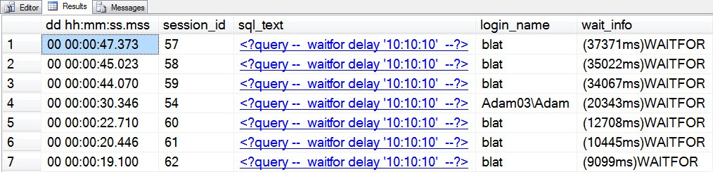
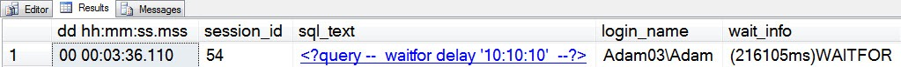

# sp_whoisactive: Deciding What (Not) To See

------
[Home](https://github.com/amachanic/sp_whoisactive)	[Download](https://github.com/amachanic/sp_whoisactive/archive/master.zip)	[Documentation Index](ReadMe.md)
------
Prior: [Active Request, Sleeping Session](08_requests.md)	Next: [Commands, Batches, and the Mysteries of Text](10_commands.md)
------

I previously explained that in the world of monitoring, [Less Data is More Data](05_lessdata.md).

The goal, again, is to avoid being distracted by a bunch of information that doesn’t matter. Your job is to find and fix the real issues, as quickly as possible.

It’s only natural that during the finding phase you might wish to focus in on some particular class of user, or application, or whatever. And that means **filters**.

By default, Who is Active filters out any session that’s not active or that doesn’t have an active request. It also filters out information about the session running Who is Active—i.e., you. The idea is that you’re probably not interested in what Who is Active is up to unless you either have way too much time on your hands, your name is Adam Machanic, or both.

If you would like to change any of the default filtered behavior, you can do so using a few options that I introduced in the Less Data is More Data post:

- **@show_sleeping_spids** defaults to a value of **1**, which means that the only sleeping sessions that will be shown are those that have an open transaction. If you would like to see all sleeping sessions, set the parameter to a value of **2**. And if you wouldn’t like to see any, regardless of whether there is an open transaction, set it to **0**.
- **@show_system_spids** can be set to **1** to capture information about background and system processes. It’s generally not very interesting to look at these, with the exception of seeing activity being done by Service Broker activation procedures—and those sessions are already shown by default in newer versions of by Who is Active.
- **@show_own_spid** can be set to **1** to capture information about the session you’re running Who is Active from. You’ll see a small chunk of the code that’s running, and it won’t be very insightful, but I’ve included the option for completeness.

Beyond the default filters, Who is Active supports the ability to do text filtering on various columns. To see how Who is Active deals with these text filters, let’s take a look at a sample set that might be returned by Who is Active:



This blat guy sure is running a lot of queries! I’m much more interested in what Adam is up to (go figure). To reduce the set to see only Adam’s activity, I can employ a filter:

```sql
EXEC sp_WhoIsActive
    @filter_type = 'login',
    @filter = 'Adam03\Adam'
```



This filter gives me an exact match on “Adam03\Adam” in the [login_name] column. And that’s great, but a lot more can be done.

#### Who is Active supports five filter types:

- “session” filters on the [session_id] column
- “program” filters on the [program_name] column
- “database” filters on the [database_name] column
- “login” filters on the [login_name] column
- “host” filters on the [host_name] column

Session is special because of the five filter types it is the only one that is numeric. “Filtering” using the “session” filter on a value of “0” returns all of the sessions to be shown based on whatever other filter options you’re working with. A non-zero value will return information only about the session you’ve specified—again, subject to other filter options. This means that if you’re looking for information on session_id 96, but that session is sleeping, and you have @show_sleeping_spids set to 0, you’re not going to see any information. **Always remember that the filters are additive**.

The other four filter types are quite a bit more flexible, because they are pure text filters. And **text filters support wildcards**. The same kinds of wildcards that you can use for LIKE or PATINDEX. Meaning that you can write the above query in a number of ways, depending on how flexible you would like to be with which sessions are returned:

```SQL
EXEC sp_WhoIsActive
    @filter_type = 'login',
    @filter = 'A%';

EXEC sp_WhoIsActive
    @filter_type = 'login',
    @filter = '%dam';

EXEC sp_WhoIsActive
    @filter_type = 'login',
    @filter = 'A[de]am03\[^B]dam';
```

**Another option is to ask Who is Active to not show certain sessions**. This is referred to as a “not-filter,” and works the same way. If you want to see everything except what blat is up to, you can do:

```sql
EXEC sp_WhoIsActive
    @not_filter_type = 'login',
    @not_filter = 'blat';
```

The not-filter option was added after some great feedback from Michelle Ufford, who was trying to use Who is Active on a system that was always busy running a huge number of automated jobs and processes. Since all of these had been running for quite some time and were rather uninteresting, Michelle wanted to see only the other, non-automated activity on the system. Not-filters support the same filter types as normal text filters, and also support wildcards. And of course, both filter types can be combined:

```sql
EXEC sp_WhoIsActive
    @filter_type = 'login',
    @filter = 'A%',
    @not_filter_type = 'login',
    @not_filter = 'b%';
```

The current set of Who is Active filters are, in my opinion, quite flexible, but I don’t feel completely satisfied. My goal is to eventually convert the entire filter mechanism to an expression language that supports arbitrarily complex filters. This would, of course, also [have to be 100% injection safe, and perform extremely well](02_design.md), so it’s a bit of a dream at the moment. But it’s an interesting problem, so I’ll continue to work on it and perhaps I’ll crack it in a future version of Who is Active.

------
Prior: [Active Request, Sleeping Session](08_requests.md)	Next: [Commands, Batches, and the Mysteries of Text](10_commands.md)
------
