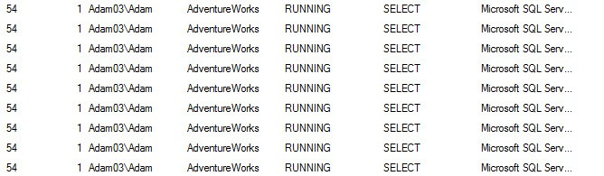
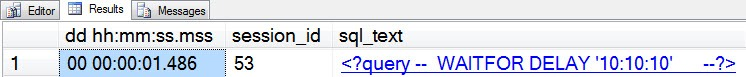
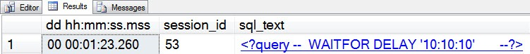
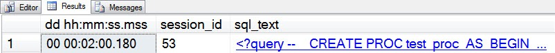
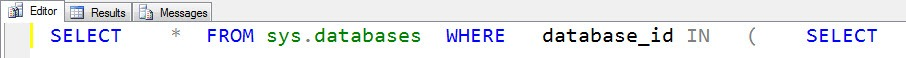
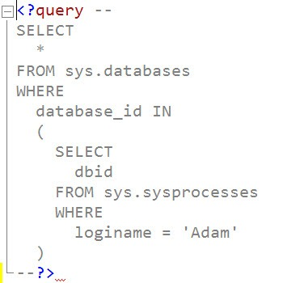
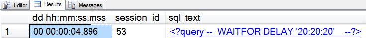
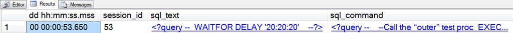

# sp_whoisactive: Commands, Batches, and the Mysteries of Text

------
[Home](https://github.com/amachanic/sp_whoisactive)	[Download](https://github.com/amachanic/sp_whoisactive/archive/master.zip)	[Documentation Index](ReadMe.md)
------
Prior: [Deciding What \(Not\) To See](09_deciding.md)	Next: [Planning for Success](11_planning.md)
------

Remember the saga of SPID 54? In case you’ve forgotten its sad tale, let’s revisit:



There it is. 54. **Doing something, as usual. And of course, that something is not exactly apparent** from the above sp_who2 output.

This is such a major defect that when I wrote Who is Active I decided to show query text by default even if it slightly slowed things down in some cases. This can be disabled—we’ll get to that in a later post—but I don’t think anyone does that very often.

To understand the differences between the options, consider the following batch:

```sql
SELECT *
FROM sys.tables

WAITFOR DELAY '10:10:10'

SELECT *
FROM sys.databases
GO
```

Running this batch on session 53, then running sp_WhoIsActive on another session, the following is output:



The [sql_text] column, by default, outputs the text of the statement that is currently running. We can instead decide to see the entire batch, by setting @get_full_inner_text:

```sql
EXEC sp_WhoIsActive
    @get_full_inner_text = 1
```


**Why is this option called “get full inner text” rather than “get full batch?”** It’s assumed that in most systems (hopefully) the majority of code running will be stored procedure calls rather than ad hoc batches. Let’s see what happens in that case:

```sql
USE tempdb
GO

CREATE PROC test_proc
AS
BEGIN
    SELECT *
    FROM sys.tables

    WAITFOR DELAY '10:10:10'

    SELECT *
    FROM sys.databases
END
GO

EXEC test_proc
GO
```

Running Who is Active with the default mode outputs pretty much the same exact thing as before:



Setting the @get_full_inner_text option now returns the entire text of the stored procedure—or the “full inner text.”



**If you’re wondering what <?query means and why the results are returned in XML format**, consider a nicely laid-out piece of code like the following:

```sql
SELECT
    *
FROM sys.databases
WHERE
    database_id IN
    (
        SELECT
            dbid
        FROM sys.sysprocesses
        WHERE
            loginame = 'Adam'
    )
```

If I were to query the various DMVs to get this text without formatting it as XML, the results would be rather ugly once I copied and pasted it out of the SSMS grid:



XML in SQL Server Management Studio has the nice property of maintaining the formatting of text nodes. Clicking on the hyperlinked XML in the [sql_text] column, rather than attempting to copy and paste, has a much nicer result:



**One other consideration is what happens when dealing with nested modules**. Consider:

```sql
USE tempdb
GO

--Create two "inner" procs

CREATE PROC inner_test_proc1
AS
BEGIN
    WAITFOR DELAY '10:10:10'
END
GO

CREATE PROC inner_test_proc2
AS
BEGIN
    WAITFOR DELAY '20:20:20'
END
GO

--Create one "outer" proc to call the others

CREATE PROC outer_test_proc
    @x INT
AS
BEGIN
    IF @x = 1
        EXEC inner_test_proc1
    ELSE
        EXEC inner_test_proc2
END
GO

--Call the “outer” test proc
EXEC outer_test_proc 2
GO
```

If you run this batch, then run Who is Active, you’ll see output like the following:



The [sql_text] column shows the WAITFOR command currently running. **Its value is always scoped to the innermost scope—the currently running batch or module**. But what if we want to get a bit more information about what call the application made to get us to this point? To get more information, use the @get_outer_command option:

```sql
EXEC sp_WhoIsActive
    @get_outer_command = 1
```



This option introduces a new column called [sql_command], which reflects the outer batch or stored procedure call that was issued by the application or user. Like the [sql_text] column, it’s clickable XML, so that you can retrieve the original format of the batch.

#### Two other considerations for the [sql_text] column:

- The SQL text in the plan cache will sometimes be locked. Who is Active will wait up to 5ms and then time out, setting the value of the [sql_text] column to “<timeout_exceeded />”
- Certain system features, such as automatic statistics updates, may cause surprising results to be returned in the [sql_text] column. For example, rebuilding an index will result in text along the lines of “insert [dbo].[yourTable] select * from [dbo].[yourTable].” If you see something like this, do not be alarmed! Take a deep breath and use the @get_outer_command option to find out what’s really going on.

------
Prior: [Deciding What \(Not\) To See](09_deciding.md)	Next: [Planning for Success](11_planning.md)
------
