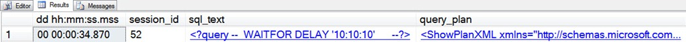
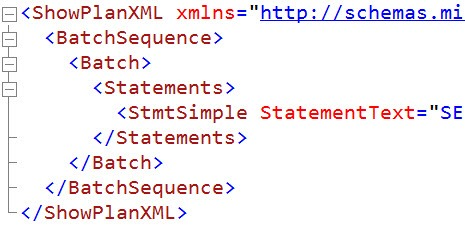
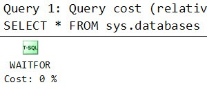
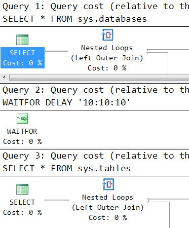

# sp_whoisactive: "Planning" for Success

------
[Home](https://github.com/amachanic/sp_whoisactive)	[Download](https://github.com/amachanic/sp_whoisactive/archive/master.zip)	[Documentation Index](ReadMe.md)
------
Prior: [Commands, Batches, and the Mysteries of Text](10_commands.md)	Next: [The Almighty Transaction](12_transaction.md)
------

**[Viewing the text of the currently running statement](11_planning.md) is a big part of the debugging battle**. Another part is being able to quickly see the associated query plan.

Due to performance concerns Who is Active does not show the query plan by default; plans for big queries can sometimes span several megabytes of XML, so accessing the plan can be expensive. **Enabling plan retrieval is simple: Use the @get_plans option**.

@get_plans has two modes:

- Setting the option to **1** will get the plan for the currently running statement
- Setting the option to **2** will get the entire plan for all queries in the currently running batch

These settings align, more or less, with the default statement text retrieval mode and the @get_full_inner_text option.

Consider the following batch:

```sql
SELECT
    *
FROM sys.databases

WAITFOR DELAY '10:10:10'

SELECT
    *
FROM sys.tables
GO
```

Running this, then running Who is Active with @get_plans set to 1, results in the addition of the [query_plan] column to the output:



The query plan is an XML showplan, and the next step for seeing the graphical version of the plan is to click on the XML instance. This will bring up a new tab in Management Studio, but **what happens next depends on which version of SSMS you’re running**. If you’re still using the SQL Server 2005 version, you’ll be greeted with a screen full of XML:



To see the plan rendered in a nice graphical format, save the XML to a file with the .SQLPLAN extension, close the file in Management Studio, then re-open it. Or, if you’re using the SQL Server 2008 version of Management Studio, forget all of the XML file stuff and just click. Either way you’ll be greeted with:



The other option is to see the plan for the entire batch. Or, phrased another way, all of the plans for each of the statements in the batch. It’s as easy as...

```sql
EXEC sp_WhoIsActive
     @get_plans = 2
```



#### Notes

- Plan collection, like statement text collection, may time out due to a lock. (See the Homework section below.)
- Both the plan and the statement text may be unavailable due to the presence of “non query” statements in the batch. Various statement types apply, and it’s not documented, but the most common problem I see is when a stored procedure uses ALTER TABLE to add a primary key to a temporary table. This disables caching for the entire stored procedure, making it impossible for Who is Active to retrieve either the text or the plan.
- **A few people have asked whether the plans returned by Who is Active are the “actual” or “estimated” plans**. The answer depends on how you define these terms. "Actual plan" usually refers to the query plan that has the actual row counts, number of executions for each iterator, and various other information that can only be collected once a query has completed. Who is Active cannot return that version of the plan. But the plan it returns is indeed the "actual" plan that's running at the time; in other words, the plan will not be recompiled into some other plan by the time Who is Active can get it.

------
Prior: [Commands, Batches, and the Mysteries of Text](10_commands.md)	Next: [The Almighty Transaction](12_transaction.md)
------
