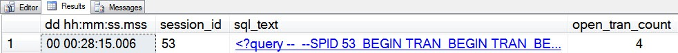
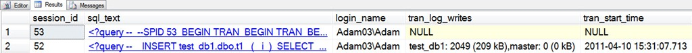
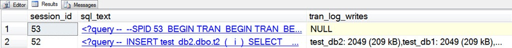

# sp_whoisactive: The Almighty Transaction

------
[Home](https://github.com/amachanic/sp_whoisactive)	[Download](https://github.com/amachanic/sp_whoisactive/archive/master.zip)	[Documentation Index](ReadMe.md)
------
Prior: [Planning for Success](11_planning.md)	Next: [How Queries Are Processed](13_queries.md)
------

**Virtually everything that SQL Server does is tied to a transaction**. Therefore, it is of utmost importance when monitoring to be able to find out what’s going on with the various transactions that are active on your SQL Server instances.

In its default mode Who is Active shows any session with an active transaction. This state is reflected in the [open_tran_count] column, the value of which is the depth of nested transactions that have been started—implicitly or explicitly—on the request or session.

```sql
 --SPID 53
 BEGIN TRAN
 BEGIN TRAN
 BEGIN TRAN
 BEGIN TRAN
 GO
```



Here the [open_tran_count] is 4, because there are four nested transactions. These transactions could have been created at various levels of scope—e.g. inside of nested stored procedures—and it is not uncommon to see cases where not enough commits are issued to match the numbered of transactions that have been started.

There are a number of transaction-related DMVs, all of which are named using the *sys.dm_tran* prefix. Who is Active currently uses three of these to expose additional information beyond the open transaction count. **To see more information, enable the @get_transaction_info option**. This option adds two columns to the Who is Active output:

- The [tran_log_writes] column includes information about any database that has been written to
on behalf of the transaction. The format for this data is a comma-delimited list, in the following form per database:
    - {database name} {number of log records written} ({size of log records} kB)

- **The [tran_start_time] column reflects the time that the first database was written to** on behalf of the transaction. This is perhaps a bit counter-intuitive, but the idea is simple: for the most part it’s not interesting to see a lot of information about read-only transactions. Millions of them start and finish every day on the average SQL Server instance. Transactions that are actually doing some work—writing something—are the ones that tend to cause the issues. Therefore, Who is Active focuses its energy there.

To see these two columns in action, leave session 53 active, and create a couple of test databases to play with:

```sql
USE master
GO

CREATE DATABASE test_db1
GO

CREATE DATABASE test_db2
GO

CREATE TABLE test_db1.dbo.t1
(
  i INT
)
GO

CREATE TABLE test_db2.dbo.t2
(
  i INT
)
GO
```

Once these are created, we can insert some rows into one of the tables inside of a multi-statement transaction...

```sql
BEGIN TRAN
GO

INSERT test_db1.dbo.t1
(
  i
)
SELECT
  number
FROM master..spt_values
WHERE
  type = 'p'
GO
```

The INSERT results in 2048 rows inserted into *test_db1.dbo.t1*. And since we haven’t committed the transaction yet, it’s still alive for Who is Active to catch.

```sql
EXEC sp_WhoIsActive
  @get_transaction_info = 1
```



Session 52—the one on which I’ve just inserted the rows, has information in both the [tran_log_writes] and [tran_start_time] columns. Session 53, on the other hand, has NULLs for both columns—even though it’s still holding an open transaction. The reason is that session 52 has actually done a write in *test_db1*, whereas session 53 has not done any work at all.

So far only one database has been touched in the transaction. Adding another database to the mix adds that database to the [tran_log_writes] output:

```sql
INSERT test_db2.dbo.t2
(
  i
)
SELECT
  number
FROM master..spt_values
WHERE
  type = 'p'
GO
```



The same amount of work has been done in both databases: 2048 rows inserted into a table. And we can see that this has produced the same number of transaction log records, and the same amount of transaction log space is being consumed in the log files of each database. That makes a lot of sense. It also makes sense that we’re seeing 2049 log records, because that corresponds to one log header record and one log record for each of the 2048 affected rows.

**Taking this a bit further makes things much very interesting for those of you doing ETL**: consider that in any situation in which minimal logging is not taking place, the number of log records that will be produced due to an INSERT, UPDATE, or DELETE, will loosely correspond to the number of rows being affected, in each index being touched by the update plan. Understanding how this works becomes very useful when monitoring large ETL processes. It’s often the case that it’s possible to make a fairly precise estimation about how many rows will be touched by each phase of a data load. By taking that number into account and taking a look at the number of indexes in the query plan, estimating how much longer the ETL will take becomes a simple matter of querying a few times to understand the rate at which rows are being written, and then doing a bit of multiplication.

As a final note, it's important to realize that there may be log writes in *tempdb* that cannot be reported by Who is Active due to the way the DMVs treat nested internal transactions. These writes are due to query processor operations such as sorts, hashes, and spools, and will be reflected in Who is Active's output in the [tempdb_allocations] column.

------
Prior: [Planning for Success](11_planning.md)	Next: [How Queries Are Processed](13_queries.md)
------
