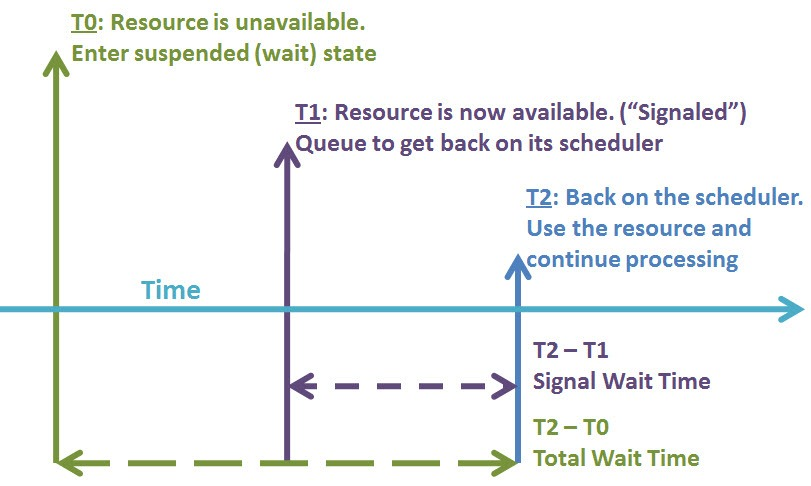
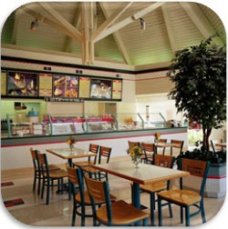
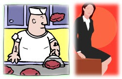

# sp_whoisactive: How Queries Are Processed

------
[Home](https://github.com/amachanic/sp_whoisactive)	[Download](https://github.com/amachanic/sp_whoisactive/archive/master.zip)	[Documentation Index](ReadMe.md)
------
Prior: [The Almighty Transaction](12_transaction.md)	Next: [Blocking, Blockers, and Other B Words](14_blockers.md)
------

**This article and the next take a take a break from Who is Active** to get into some important background information on how things work internally in the query processor. The DMVs—and, therefore, Who is Active—reveal fairly deep information about what’s going on with your query, but unless you understand the basics it’s going to be difficult to properly interpret that data.

Most of the time when people teach this subject, they start off with an image like the following:

**That’s all well and good, except that it’s a bit on the dull side.**

A nicer approach, in my opinion, is to teach this topic using a metaphor. And others seem to agree: Joe Sack uses a grocery store checkout line, Rob Farley created a metaphor involving airport check-in lines, and Robert Davis has recommended something to do with running out of toilet paper while using a public bathroom stall. (I didn’t ask.)

**My metaphor is a diner**. The Resource Diner. It’s open 24 hours a day, 7 days a week (99.999% of the time, when the staff is doing its job properly), and it’s where workers go when they’re hungry. And workers are *always* hungry. But I’m getting ahead of myself a bit.

**It all begins with a query**. You send it to SQL Server, and it gets parsed, and bound, and optimized, and the output is a plan. A plan is a program for the query processor to run. The query processor needs to run this program on physical CPUs, using physical memory, and perhaps physical disk drives. But it doesn’t talk to these various physical components directly; rather, it uses abstractions. Most of these abstractions are provided by SQLOS, some by the storage engine, and still others by the Windows kernel itself. One of the main abstractions is that over operating system threads. The abstracted version is called a *worker*, and the worker executes *tasks*, which are essentially segments of the plan. A serial plan will have one task, and a parallel plan may have many. (See my [SQL University](http://dataeducation.com/sql-university-parallelism-week-introduction/) series for more information.)

**While executing a task, the worker can really do only two things**: consume CPU time, and wait for some resource that it needs to use in order to consume CPU time.

**And that is why workers are always hungry**.

When a worker gets hungry, it visits the restaurant. It already knows what it wants to eat, so it doesn’t bother with the menu. It goes straight to the cashier and makes its request.

“I’ll have a page lock with extra schema stability on the side.”

Sometimes the resource is already available, sitting there warming under the heat lamps. The worker can take it and get right back to consuming CPU time.

But sometimes the resource isn’t ready yet. Perhaps an exclusive lock on the resource is being held by someone else, or perhaps the page needs to be read off the disk, or perhaps some memory needs to be granted.

When a worker needs a resource, it can’t go off and do something else in the meantime. It wants to consume the resource it needs. So the “order” is sent off to be prepared, and meanwhile the worker has to *wait*.

Eventually, the worker is called over the loudspeaker. “Order up! One page lock, extra schema stability on the side!” (This is called being *signaled*.) The worker can now get its resource from the cashier! But lo and behold, other workers have come into the restaurant while our worker was waiting. They’re getting orders from the cashier. So our worker will have to wait some more. This is known as being in the *runnable queue*.

After a long and arduous wait, our heroic worker finally gets its resource and can chow down. Ahh, life is good.

Now that the metaphor has been laid out, let’s take another look at the oh-so-dull technical image from above:

Here’s what’s going on:

- Time 0 is when the worker gets hungry. It needs a resource. Let’s say that it’s a certain page.
    - If it’s already available (e.g. the page is in the buffer cache), there is no wait. The worker can immediately continue its work.
	- If the page isn’t in the cache, it needs to be read off disk. The worker stops working, gets off of its scheduler, and starts waiting.

- Time 1 is when the food is ready. The page has now been read off of the disk. The worker is ready to get back on the scheduler and continue its work, but some other process may have started working on the scheduler in the meantime. And there may be a line of other workers, all waiting for the scheduler. If there is a line, the worker has to wait yet again—but this isn’t a *resource wait* anymore. It’s now a *signal wait*.

- Time 2 is when the worker finally gets back to the cashier. It takes its resource and gets to work again on the scheduler.

The important intervals here are between Time 0 and Time 1 (resource wait time) and between Time 1 and Time 2 (signal wait time). The resource wait time is impacted by however long it takes to read the page off of the disk, grant the memory, fulfill the lock request, or whatever. The signal wait time is almost entirely impacted by how busy the scheduler happens to be.

------
Prior: [The Almighty Transaction](12_transaction.md)	Next: [Blocking, Blockers, and Other B Words](14_blockers.md)
------
