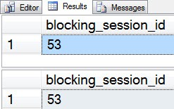
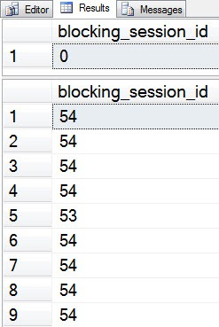
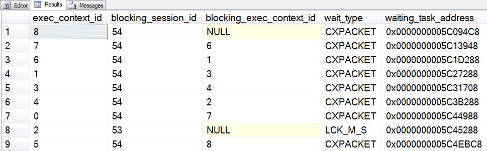
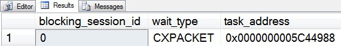

# sp_whoisactive: Blocking, Blockers, and Other B Words

------
[Home](https://github.com/amachanic/sp_whoisactive)	[Download](https://github.com/amachanic/sp_whoisactive/archive/master.zip)	[Documentation Index](ReadMe.md)
------
Prior: [How Queries Are Processed](13_queries.md)	Next: [Seeing the Wait That Matters Most](15_waits.md)
------

[The prior article](13_queries.md) was an introduction to query processing and wait states. **This article looks at the most famous and most feared wait of them all: blocking!**

The word “blocking” has such a bad connotation, it’s almost at a disadvantage right off the bat. It sounds as though someone has started up some query for the express purpose of getting in your way. They’re letting that query run, and making sure that it’s keeping its transaction open as long as possible, so as to keep your query from doing the work it needs to do. Blocking!

The reality is that blocking is nothing more than a specific type of wait. Just like a disk wait, or a memory grant wait, or any of the many other wait types. Blocking is a wait for a lock. And that lock was probably taken for a good reason. Most, believe it or not, are. Locks are there to protect our data from various forms of corruption and inconsistency, and to help maintain those ACID properties that we all know and love. Blocking is a natural side-effect. It’s not only common, it’s also very much to be expected.

**What we need to be concerned with is not blocking, but rather excessive blocking**. This means extended blocking waits that really are slowing down your queries and causing work to grind to a halt. While this may seem obvious to most readers, the fact is that it's quite common to see DBAs to get way too caught up in looking for blocking, in an attempt to somehow eliminate it altogether. That's simply not possible, so my recommendation is to relax and try to focus on outlier conditions.

Block monitoring via DMVs can be done in various places. The *sysprocesses*, *sys.dm_exec_requests*, and *sys.dm_os_waiting_tasks* views all expose information about blocking. But the information is at different levels of granularity, and it can be interpreted in various ways. Sometimes in the wrong way.

To illustrate this issue, we first need to create a blocking situation. I like to use *AdventureWorks*:

```sql
USE AdventureWorks
GO

BEGIN TRAN

UPDATE TOP(10) Sales.SalesOrderDetail
SET OrderQty += 7
GO
```

Next—in a new window—we can query the *SalesOrderDetail* table. This will, of course, create blocking:

```sql
SELECT
  *
FROM Sales.SalesOrderDetail
```

I’ve set up the blocker transaction on session 53, and the blocked session is 54. And when I ask the DMVs for more information, the results are not surprising...

```sql
SELECT
  blocking_session_id
FROM sys.dm_exec_requests
WHERE
  session_id = 54;
  
SELECT
  blocking_session_id
FROM sys.dm_os_waiting_tasks
WHERE
  session_id = 54;
```



**Things get quite a bit more interesting when parallelism is involved**. The following query will go parallel on most test systems:

```sql
SELECT TOP(1000)
  *
FROM Sales.SalesOrderDetail
ORDER BY
  SalesOrderDetailId DESC
```

Running this on session 54 creates blocking, just like the previous query. But re-running the two DMV queries from above yields completely different results:



The *sys.dm_exec_requests* view now says that there is no blocking. And the *sys.dm_os_waiting_tasks* view now says that session 54 is blocking itself, except when it’s being blocked by session 53. Clearly, something is amiss.

We can start to understand the situation in the *sys.dm_exec_requests* view by adding a few additional columns:

```sql
SELECT
  exec_context_id,
  blocking_session_id,
  blocking_exec_context_id,
  wait_type
FROM sys.dm_os_waiting_tasks
WHERE
  session_id = 54;
```



Each of the rows above represents a different execution context ID (a way of identifying a worker thread; I’ve also included the [waiting_task_address] column, which can be used for the same purpose) that is being used by the query processor to evaluate the query plan. Seven of the eight threads are waiting on *CXPACKET*—the special exchange iterator wait used in all parallel plans. These threads are waiting on rows from an upstream parallel scan. And most of the threads are being “blocked” by other threads that are associated with the same request. This is not true blocking in the usual sense of the term. It’s simply multi-threaded synchronization, but the DMVs are not quite granular enough to report things that way.

**Only execution context 2 is actually being blocked**. (We can see the lock wait, *LCK_M_S*.) The rest can be said to be blocked as well, but only virtue of the execution context chain. Any thread from a given session reported as “blocking” a thread from the same session should never be a concern to us as SQL Server end users, unless there is a bug in the product. And while bugs do happen from time to time, that’s certainly not the case here.

Execution context 0 in this and other parallel plans is special. It’s the coordinator thread (a.k.a. parent thread, a.k.a. dispatcher thread, a.k.a. root thread) that spawns the other worker threads and then waits for them to complete. It’s not blocked directly, and the DMV reports that it is waiting on *CXPACKET*. Let’s take another look at *sys.dm_exec_requests*, this time with more columns:

```sql
SELECT
  blocking_session_id,
  wait_type,
  task_address
FROM sys.dm_exec_requests
WHERE
  session_id = 54;
```



Using the [task_address] column and comparing it to the various task addresses in the *sys.dm_os_waiting_tasks* view, we can get to the bottom of the mystery. The reported address matches that of execution context 0 above. So we can conclude that ***sys.dm_exec_requests* is giving us information only about the coordinator thread**. And it is correctly reporting that there is no blocking *on that thread.* Unfortunately, the nasty side-effect of correctness in this case is that we miss the fact that there is indeed blocking *for the request as a whole*.

Making Who is Active behave properly in this case was a big win—it’s the difference between seeing and being able to understand blocking in a straightforward manner and not seeing it at all. Over the next couple of days I will describe how these situations are handled in the stored procedure.

------
Prior: [How Queries Are Processed](13_queries.md)	Next: [Seeing the Wait That Matters Most](15_waits.md)
------
