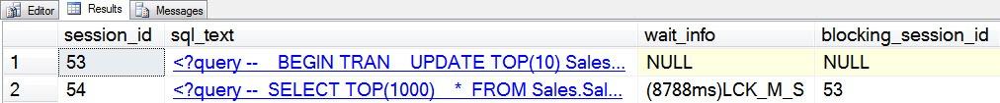

# sp_whoisactive: Seeing the Wait That Matters Most

------
[Home](https://github.com/amachanic/sp_whoisactive)	[Download](https://github.com/amachanic/sp_whoisactive/archive/master.zip)	[Documentation Index](ReadMe.md)
------
Prior: [Blocking, Blockers, and Other B Words](14_blockers.md)	Next: [Seeing All of the Waits](16_morewaits.md)
------

The prior two articles delved into the internal workings of the query processor, specifically around tasks and the work-wait lifecycle. **Understanding how tasks work is a key prerequisite for understanding some of the data most useful that Who is Active can return**—so if you haven’t read those posts, go do that before reading this one.

The “waits and queues” performance tuning methodology involves tuning a system by looking at what processes are waiting on, rather than by focusing solely on performance counters and similar metrics. Waits and queues is generally applied in the SQL Server world on an instance-global level, using the *sys.dm_os_wait_stats* view. And while this can give you some insight into what your instance is spending its time doing, I’m personally much more interested in the real-time wait stats provided by some of the other DMVs—and that is, of course, the data that Who is Active returns.

Yesterday’s post was all about blocking, and the fact that a given request can have multiple waits reported by the DMVs. In the example I used for the post, most of these waits were *CXPACKET*. But in real-world queries there can be numerous different waits, all happening on different tasks that are busy doing various things on behalf of the query.

Initial versions of Who is Active returned information about all of the waits reported in the waiting tasks view, but I found that this was a bit too heavy in most cases. Not only did it slow down the stored procedure, but it also delivered a lot more information than many people were equipped to deal with. So at some point I introduced the current default model, the “lightweight” waits collection mode. **This mode returns, at most, information about one wait per request**; the most important wait, per the logic I’ve implemented. Here’s how it works:

- All of the waits are evaluated and prioritized
- *CXPACKET* waits—the parallelism waits—are discarded
- Blocking waits get top priority
- After that, priority is given to waits that have been outstanding for the longest amount of time
- Any remaining ties are broken by ordering by the blocking session ID

**The most controversial part of this system, based on the number of questions I’ve received, seems to be the removal of the *CXPACKET* waits**. But for me it’s a relatively straightforward move. *CXPACKET* waits mean parallelism. Parallelism means *CXPACKET* waits. The coordinator thread will *always* wait on *CXPACKET* while the worker threads are busy. That’s just how the system is designed. Therefore, the longest waits for any given plan that is being processed in parallel will be waits on *CXPACKET*. Does that mean there’s a problem? No—not unless you feel that parallelism itself is a problem (and I most certainly do not).

**If you have a parallel query that’s taking a long time, it's probably not due to excessive waiting on *CXPACKET***. While there is such a thing as a query that probably shouldn’t be using parallelism, there are no simple metrics or formulas that will help you figure that out based on the *CXPACKET* wait time. It’s really something that needs to be addressed on a case-by-case basis. A much better idea is to look at the *other* threads—those that aren’t waiting on *CXPACKET*—to see what they’re waiting on. The threads waiting on *CXPACKET* are waiting for data from those other threads, so it’s by looking at the other threads that you’ll find the actual performance culprits.

For these reasons, *CXPACKET* is discarded in the default waits collection mode. After getting rid of those waits, blocking waits are sent to the top of the list. Heavy blocking is certainly something that you want to be aware of—it absolutely will slow down your queries (and maybe even cause them to grind to a halt), and information about blocking is one of the core things that Who is Active is designed to show.

Assuming that there is no blocking, or even if there is blocking on two different threads and a priority is needed, the longer waits get pushed to the top. The reasoning is simple: longer waits slow down your query more than shorter waits. And you want to see the worst culprits when looking at wait information.

All of this sorting results in a single wait (or, on very rare occasions, multiple waits, in which case the tie is broken using a row number). Unlike the wait information in *sys.dm_exec_requests*, this wait does not arbitrarily correspond to the coordinator thread. It is instead the one wait that is most important for you to focus on at the time the data was collected. The wait that actually matters. **Here is the blocking situation from yesterday as viewed through the eyes of Who is Active’s lightweight waits collection mode**:

------
Prior: [Blocking, Blockers, and Other B Words](14_blockers.md)	Next: [Seeing All of the Waits](16_morewaits.md)
------
