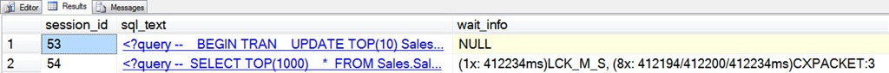
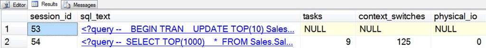

# sp_whoisactive: Seeing All of the Waits

------
[Home](https://github.com/amachanic/sp_whoisactive)	[Download](https://github.com/amachanic/sp_whoisactive/archive/master.zip)	[Documentation Index](ReadMe.md)
------
Prior: [Seeing the Wait That Matters Most](15_waits.md)	Next: [Is This Normal?](17_normal.md)
------

Who is Active’s default lightweight waits collection is designed to show you the most important wait that’s currently slowing down your request. But in doing so it hides a lot of information. **Who is Active is capable of showing you information about all of the waits that are currently pending on behalf of your request**. All you need to do is modify the *@get_task_info* parameter...

```sql
EXEC sp_WhoIsActive
  @get_task_info = 2
```

This causes the single wait described in the [prior article](15_waits.md) (the blocking wait, *LCK_M_S*) to become a report about all nine waits (see the [article on blocking](14_blockers.md) for background information):



We now see the full picture, including both the lock wait and all of the *CXPACKET* waits. Each wait type is broken out and accompanied by information on how many waits there are, and how long the waits have been outstanding. In this case we have a single task that is waiting on *LCK_M_S* and eight tasks waiting on *CXPACKET*.

Depending on how many tasks are waiting for each wait type, Who is Active breaks out the times as follows:

- One waiting task: *(1x: MINms)[wait_type]* where MINms is the number of milliseconds that the task has been waiting
- Two waiting tasks: *(2x: MINms/MAXms)[wait_type]* where MINms is the shorter wait duration between the two tasks, and MAXms is the longer wait duration between the two tasks
- Three or more waiting tasks: *(Nx: MINms/AVGms/MAXms)[wait_type]* where Nx is the number of tasks, MINms is the shortest wait duration of the tasks, AVGms is the average wait duration of the tasks, and MAXms is the longest wait duration of the tasks

In this case the *LCK_M_S* wait has been pending for just over 412 seconds. The exchange waits all started building up just after the block situation started, so the minimum and average wait times for those are within a few milliseconds of the wait time for the blocking wait.

**In addition to the pending wait time, some additional information gets shipped along with three wait categories**:

- For waits matching the pattern *PAGE%LATCH%* (*PAGEIOLATCH* or *PAGELATCH*), the page number is evaluated to find out if it is one of the “special” page types: PFS, GAM, SGAM, DCM, or BCM. If so, the wait is flagged as being on one of those pages. (The page type will appear in parenthesis after the wait type; if it’s not one of those page types, it will be listed as ***). A post later this month will explain why this is important.
- Waits matching the pattern *LATCH[_]%* are latch waits on a specific latch class. Who is Active reports the latch class along with the wait. (Again, the additional information latch class will appear in parenthesis.)
- *CXPACKET* waits ship with a node identifier, corresponding to a node in the query plan. The node ID is included after the wait, separated by a colon. In the above image, the *CXPACKET* waits are all occurring on node 3 in the query plan. As with the “special” pages, I’ll cover this feature in more detail in a later post.

**A bit more information is available when using *@get_task_info* = 2**. Three additional columns are added to the Who is Active output, which apply to active requests (all three will be NULL for sleeping sessions).



- [tasks] is the number of active tasks currently being used by the request.
- [context_switches] is the number of context switches that have been done for all of the tasks currently being used by the request. This number is updated in real time and can give a closer approximation of CPU utilization when evaluating requests that are being processed using a parallel plan.
- [physical_io] is the number of physical I/O requests that have been issued on behalf of all of the tasks currently being used by the request. Again, this number is updated in real time.

**The key term for all of these is “real time”**—even for parallel plans. This is in stark contrast to the [CPU], [reads], [writes], and [physical_reads] columns that are in the default output, and which are not updated in real time once more than one thread is involved. Unfortunately, real time also has its drawbacks. As the various tasks that are working on behalf of the query begin finishing their work, the numbers will no longer be cumulative to the query, and will cease to make a whole lot of sense. That’s a small price to pay, in my opinion, for timely information when looking at active queries.

------
Prior: [Seeing the Wait That Matters Most](15_waits.md)	Next: [Is This Normal?](17_normal.md)
------
