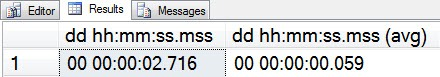

# sp_whoisactive: Is This Normal?

------
[Home](https://github.com/amachanic/sp_whoisactive)	[Download](https://github.com/amachanic/sp_whoisactive/archive/master.zip)	[Documentation Index](ReadMe.md)
------
Prior: [Seeing All of the Waits](16_morewaits.md)	Next: [Getting More Information](18_moreinfo.md)
------

#### There you are, minding your own business (and that of everyone else on your server) checking out activity with Who is Active.

Some stored procedure is running for what seems like an excessive amount of time—but you’re not quite sure. Should you take a closer look?

The answer can only be my favorite two-word phrase: It Depends.

If a system has been live for quite some time and users are happy enough with performance, I tend to not get too caught up in proactively trying to find things to tune. If, on the other hand, users are complaining, or something has just started taking a lot longer than it used to, then it’s time to step in and do some tuning.

**Today’s post is about helping you figure out whether you’ve identified one of these latter cases: a query that was running fine, but is suddenly not doing so well**. This can happen due to any number of root causes, the most common of which are outdated statistics and parameter sniffing. Actually fixing the problem is beyond the scope of this post, but identifying it is half the battle.

Who is Active’s *@get_avg_time* option is designed for this scenario. When enabled, a new column is added to the Who is Active output, [dd hh:mm:ss.mss (avg)]. This column reflects the average run time—if it’s available—of the statement that your request is currently working on. The idea is that if you’re not sure whether the current run time is an anomaly, you can compare it to how long previous runs have taken to figure out whether you have reason for concern. Note that this is only useful if the server happens to have cached statistics about prior runs. If the cache has been cleared recently due to a reboot, memory pressure, or someone changing the server configuration options, all bets are off.

To see the feature in action, we can simulate a basic parameter skew issue. Set up the following stored procedure in *AdventureWorks*:

```sql
USE AdventureWorks
GO
CREATE PROC #sniff_test
  @min_ProductID INT,
  @max_ProductID INT
AS
BEGIN
  SELECT
    p.ProductID,
    COUNT(th.TransactionID),
    COUNT(sod.SalesOrderID)
  FROM Production.Product AS p
  LEFT OUTER JOIN Production.TransactionHistory AS th ON
    th.ProductID = p.ProductID
  LEFT OUTER JOIN Sales.SalesOrderDetail AS sod ON
    sod.ProductID = p.ProductID
  WHERE
    p.ProductID BETWEEN @min_ProductID AND @max_ProductID
  GROUP BY
    p.ProductID
END
GO
```

Now exercise the procedure a few times to get a baseline:

```sql
EXEC #sniff_test
  @min_ProductID = 1,
  @max_ProductID = 700
GO 100
```

Once the baseline has been established you’ll have a nice set of statistics recorded in the cache. Changing the arguments ever-so-slightly will have an enormous impact on the run time:

```sql
EXEC #sniff_test
  @min_ProductID = 1,
  @max_ProductID = 800
GO
```

While that’s churning away, bring up a new window and run Who is Active using the *@get_avg_time* option.

```sql
EXEC sp_WhoIsActive
  @get_avg_time = 1
```

The result will be something like the following:



From these results we can see that when I ran Who is Active the procedure had already been running for over two seconds. But the average time is a mere 59 milliseconds. Clearly, something is amiss. (And indeed it is: both an inappropriate plan and a *ProductID* range with a lot more information than the prior range that was used.)

------
Prior: [Seeing All of the Waits](16_morewaits.md)	Next: [Getting More Information](18_moreinfo.md)
------
