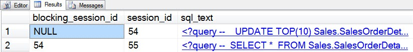

# sp_whoisactive: Why Am I Blocked?

------
[Home](https://github.com/amachanic/sp_whoisactive)	[Download](https://github.com/amachanic/sp_whoisactive/archive/master.zip)	[Documentation Index](ReadMe.md)
------
Prior: [Getting More Information](18_moreinfo.md)	Next: [The Node Knows](20_node.md)
------

**Debugging a blocking situation can be a complex process**. First you need to figure out who’s doing the blocking, and who’s getting blocked. Next—before you can actually debug things—you need to figure out what the lock is that’s actually causing the blocking to occur.

This second phase has been known to cause many a DBA to rip out numerous hairs. First comes a visit to the locks DMV, followed by an extended period of research. What is a [resource_associated_entity_id]? Does that have any bearing on the [request_owner_lockspace_id]? And do you even care? If you’re anything like me, most of the time you just want to move on with life.

**Who is Active solves this problem in two distinct ways**, the first of which I’ll cover in today’s post, and the second a few posts down the road. Which method you choose depends on how much context you need to solve the problem at hand, and how much pressure you’re willing to put on your SQL Server instance. Today’s method is much lighter weight in terms of resource consumption and, in many cases, elapsed time.

Creating a blocking situation is easy enough... In one window do:

```sql
USE AdventureWorks
GO

BEGIN TRAN
GO

UPDATE TOP(10) Sales.SalesOrderDetail
SET
  OrderQty += 7
GO
```

And in a second:

```sql
USE AdventureWorks
GO

SELECT *
FROM Sales.SalesOrderDetail
GO
```

Who is Active figures things out easily enough in its default mode:



**...but what if things weren’t quite so cut-and-dry and you needed a bit more information?** In this case, you could enable two options that have been covered in prior articles: *[@get_task_info = 2](16_morewaits.md)* and *[@get_additional_info = 1](18_moreinfo.md)*. Who is Active uses these two options together to populate the [additional_info] column with information about what object is actually causing the blocking situation to occur:

```sql
EXEC sp_WhoIsActive
  @get_task_info = 2,
  @get_additional_info = 1
```


Clicking on the [additional_info] column for the blocked session reveals...


...full information about the blocked object. This particular lock is a page lock on the Sales.SalesOrderDetail table (go figure). Information can be resolved for virtually all types of locks, and generally speaking this mode does the work extremely quickly, so it should not add a lot of overhead to your monitoring sessions.

------
Prior: [Getting More Information](18_moreinfo.md)	Next: [The Node Knows](20_node.md)
------
