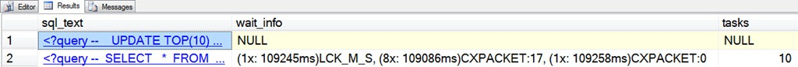
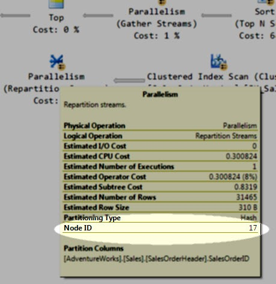

# sp_whoisactive: The Node Knows

------
[Home](https://github.com/amachanic/sp_whoisactive)	[Download](https://github.com/amachanic/sp_whoisactive/archive/master.zip)	[Documentation Index](ReadMe.md)
------
Prior: [Why Am I Blocked?](19_whyblocked.md)	Next: [Analyzing Tempdb Contention](21_tempdb.md)
------

**Query plans are packed with information about what’s going to happen, or what has happened.** But they’re markedly quiet about what *is happening*.

This is probably best illustrated with an example. Consider: you’re sitting there at your desk one morning, enjoying a nice hot cup of coffee, when the phone rings. It’s Steve, the harried middle manager who sits on the 2nd floor. “Help!” Steve shouts into the phone, making you flinch and immediately move the headset away from your ear. “My report has been running for 10 minutes! I have a meeting in three minutes! Is it going to finish?”

You calmly open Management Studio, fire up Who is Active, and glance at the various columns. No blocking. No extreme waits. Nothing too interesting in the plan. Just a big query chugging along.

At this point there’s really not much you can do. But **there is one hint that *might* help give you some more insight**. Who is Active collects, along with *CXPACKET* waits, a node identifier. These are displayed along with the wait when *@get_task_info = 2* is used. This can help you figure out approximately what your plan is up to *right now*.

Too see this in action, first create a blocking situation so that we have something to look at:

```sql
USE AdventureWorks
GO

BEGIN TRAN
GO

UPDATE TOP(10) Sales.SalesOrderDetail
SET
  OrderQty += 7
GO
```

Next, in a new window, fire up the following query:

```sql
USE AdventureWorks
GO

SELECT
  *
FROM
(
  SELECT
    sh.*,
    sd.ProductId,
    ROW_NUMBER() OVER
    (
      PARTITION BY sd.SalesOrderDetailId
      ORDER BY sd.ProductId
    ) AS r
  FROM
  (
    SELECT TOP(1000)
      *
    FROM Sales.SalesOrderDetail
    ORDER BY
      SalesOrderDetailId DESC
  ) AS sd
  INNER JOIN Sales.SalesOrderHeader AS sh ON
    sh.SalesOrderId = sd.SalesOrderId
) AS s
WHERE
  s.r = 1
GO
```

Assuming that you have a multicore machine, the plan for this query will have a few different parallel sections. Which is what we need for *CXPACKET* waits. Let’s see what Who is Active has to say about the situation:

```sql
EXEC sp_WhoIsActive
  @get_task_info = 2,
  @get_plans = 1
```



The query has 10 tasks. One of them waiting on a lock; we’ll ignore that one since we’ve created the lock to “pause” things in this case. The other nine are all waiting on *CXPACKET* waits—but there are two different groups. The first group consists of eight tasks, all waiting on node 17. The second group has only a single task, and it’s waiting on node 0.

So what are these nodes? Bring up the plan, hover over any of the iterators therein, and you’ll see:



**Every iterator in the plan has an associated node identifier**. These range from 0—for the leftmost node in the plan—on up, as you move to the right. *CXPACKET* waits are associated with exchange (parallelism) iterators, and the wait information includes the actual node identifier from the plan. By using this information you can begin to understand the flow of data through your larger plans, as task waits move from node to node.

This is certainly not a perfect solution, and chances are very good that you won’t be able to give Steve from the 2nd floor the exact amount of time remaining. But every bit of information helps, and in this case you may be able to come up with a reasonable estimate. Even if he ends up running to the meeting with only half of the report printed.

------
Prior: [Why Am I Blocked?](19_whyblocked.md)	Next: [Analyzing Tempdb Contention](21_tempdb.md)
------
