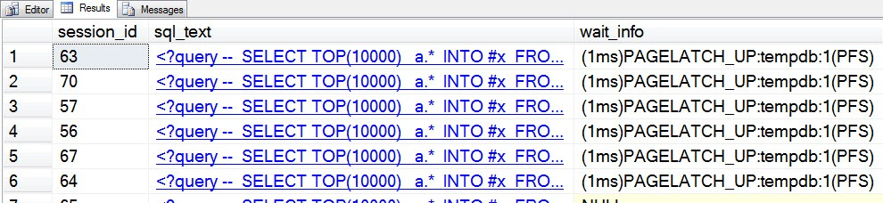

# sp_whoisactive: Analyzing Tempdb Contention

------
[Home](https://github.com/amachanic/sp_whoisactive)	[Download](https://github.com/amachanic/sp_whoisactive/archive/master.zip)	[Documentation Index](ReadMe.md)
------
Prior: [The Node Knows](20_node.md)	Next: [The Key to Your Locks](22_locks.md)
------

#### *Tempdb*. Everyone’s favorite shared bottleneck.

The funny thing about *tempdb* is that it’s not heavily used by every query. It’s only really hammered by the very *biggest* or *most frequent* queries. The queries where performance really matters. And of course, that makes the situation all the worse. When *tempdb* is a problem, it’s a *major problem*.

A common cause of *tempdb* issues is *latch contention*. This occurs due to three “special” page types: GAM (Global Allocation Map), SGAM (Shared Global Allocation Map), and PFS (Page Free Space). Each of these pages (sometimes many of each) exist in all database files, and they are responsible for helping to identify where incoming data can be written in the physical file. For complete background, [read this post by Paul Randal](https://www.sqlskills.com/blogs/paul/the-accidental-dba-day-27-of-30-troubleshooting-tempdb-contention/).

Whenever a process needs to update one of these special pages, a *latch* is taken. A latch can be thought of as a kind of very lightweight lock; it’s designed for synchronization and is intended to be quickly turned on, and then just as quickly turned off after it’s no longer needed. The problem occurs when lots of processes happen to hit the SQL Server instance at the exact same time, and they all need to find a place to store some data. Suddenly, there are numerous outstanding latch requests. They start queuing up, and before you know it the last one in line has been waiting for seconds—and not doing any work at all in the meantime.

Seeing this in action is quite simple. Create a bunch of temporary tables, in a very short period of time. I like to demo this using [SQLQueryStress](https://www.microsoft.com/en-us/p/sqlquerystress/9n46qj5sbgkb?activetab=pivot:overviewtab). Ideally you should do this kind of test on a server with only a single *tempdb* data file, to really highlight the issue. Here’s the code to run:

```sql
SELECT TOP(10000)
  a.*
INTO #x
FROM
  master..spt_values a,
  master..spt_values b
```

20 or so concurrent threads should do it. Hit the start button in your load tool, wait a few seconds, run Who is Active, and you’ll see something similar to:



**See those *PAGELATCH* waits?** They’re all on the same resource: PFS pages, in *tempdb* file ID 1. The format for *PAGELATCH* and *PAGEIOLATCH* waits is: *\[wait_type]:\[database_name]:\[file_id](page_type)*. Who is Active can decode the page types for GAM, SGAM, PFS, DCM (Differential Change Map), and BCM (Bulk Change Map) pages. For any other page, the page type will be an asterisk (*).

These waits are all on *update* (UP) latches, but it's also quite common to see *exclusive* (EX) latches when this problem occurs

**Fixing this problem is amazingly simple**: just create more *tempdb* files! When you create additional *tempdb* files—as long as they’re equally sized—SQL Server will automatically balance incoming requests across the multiple files. Since each file maintains its own PFS, GAM, and SGAM information, the contention will be eliminated.

How many files should you create? Well, that depends on your workload. I take a simple approach: start with a number of files equal to one quarter to one half of the number of logical schedulers. If the contention goes away (i.e. Who is Active is no longer showing *PAGELATCH* waits on these special pages in *tempdb*), stop there. Otherwise, keep increasing the number of files until the contention does go away.

**Again: make sure to keep the files equally sized!** SQL Server’s algorithm is based on a *proportional fill* model, which means that if one file is bigger than the others it will be chosen more often. This will cause it to grow more quickly, which will cause it to be chosen more often, which will cause it to grow more quickly, which will keep compounding until your disk is full and your performance is back in the red zone. Not a good situation to get yourself into. Grow the files bigger than you need them at create time, and monitor to make sure things don’t get out of hand.

------
Prior: [The Node Knows](20_node.md)	Next: [The Key to Your Locks](22_locks.md)
------
