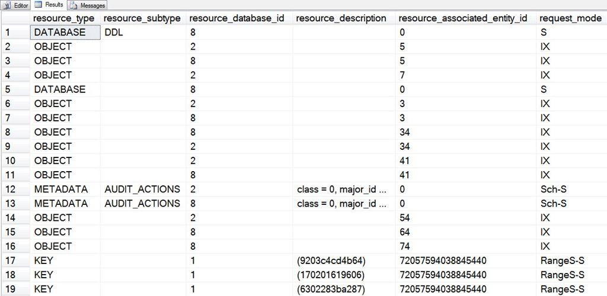
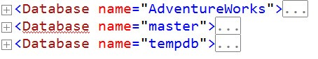
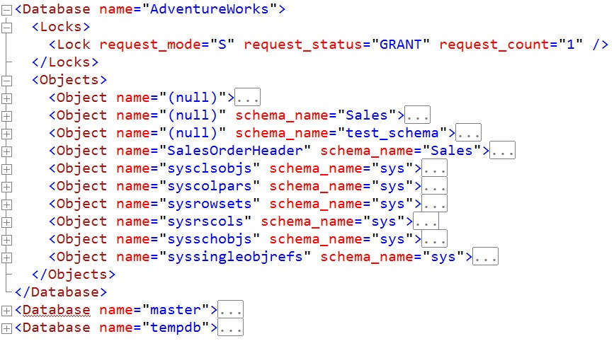
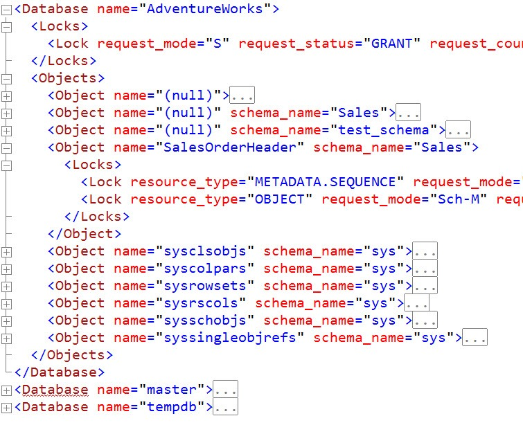

# sp_whoisactive: The Key to Your Locks

------
[Home](https://github.com/amachanic/sp_whoisactive)	[Download](https://github.com/amachanic/sp_whoisactive/archive/master.zip)	[Documentation Index](ReadMe.md)
------
Prior: [Analyzing Tempdb Contention](21_tempdb.md)	Next: [Leader of the Block](23_leader.md)
------

**Blocking has been a theme of a [couple](14_blockers.md) of [prior](19_whyblocked.md) articles**. And that’s not even the end of it. Helping you find and properly evaluate blocking issues is a core part of Who is Active’s *raison d'être*.

Behind every block is something causing the block. Something that, without which, there could be no block. And that thing is called a *lock*.

Locks are synchronization objects. Their mission in life is not to give you headaches when dealing with blocking issues, but rather to help maintain the ACID properties that are a big part of the reason that DBMS technology is so popular. For locks in particular this means the “I” property: Isolation. (And, to a lesser extent, the "C" property: Consistency.) Locks keep readers from reading data that writers haven’t finished writing, and they keep writers from overwriting data as it’s being read or written by someone else. This is a good thing. Failure to take these kinds of precautions would result in chaos. And a lot of really bad data.

When a DBA sees blocking, her first instinct is to eliminate it. Kill the blocker! Add a *NOLOCK* hint! Change the processes around! But blocking is not necessarily a bad thing. Blocking means that your data is being protected. Readers are getting consistent results. Writers aren’t overwriting each other. Everything is as it should be—even if your queries are waiting an inordinate amount of time for data.

**When you see blocking, the correct move is not to eliminate it, but rather to *evaluate* it**. Figure out what’s causing the blocking. Figure out why (or whether) it’s necessary, and what the alternatives might be. Then—and only then—should you start killing sessions, adding hints, or taking similar action.

Evaluating blocking can be a painful experience. The *sys.dm_tran_locks* view (formerly *syslockinfo*) contains a large number of columns. Many of these are numeric values that need to be referenced elsewhere in order to be meaningful to the average human. And even then, it’s simply not a very nice user experience...

**Glancing at this list of lock information, it’s impossible to tell what’s going on**. (The query I ran to pull up this list returned 2700 rows.)

Who is Active solves this problem by putting locks into a somewhat more human-readable form: a custom XML format. The stored procedure does all of the work of going to the databases with locks and decoding the numbers. So instead of seeing something like *72057594038845440*, you’ll see something like *Sales.SalesOrderHeader*. Whether or not you think that XML in general is a very readable format, the fact that the various object names have been resolved for you makes it a lot better than a straight query against *sys.dm_tran_locks*.

**To get lock information, use Who is Active’s *@get_locks = 1* option**. This will add a column called [locks] to the output. The column is typed as XML, and you can click on it to see the full contents. The document will have one root node per database in which there are locks. For the table listed above, the collapsed nodes look like this:

Under each database node is one node that represents locks on the database itself, and a node called *Objects* that contains subnodes for each object in the database that’s locked. These are grouped by object name and schema name:

Any given object can have multiple types of active locks issued against it at one time, so inside of the *Object* nodes are one or more *Lock* nodes:

This format allows for quick and simple exploration of the various locks that are active on behalf of your session. Each *Lock* node has an attribute called *request_status*. If its value is “GRANT,” the lock is held by the session. If its value is “WAIT,” the request is waiting to acquire the lock.

A full description of the various lock types is well beyond the scope of this post, but most of them are documented in the [Books Online entry for sys.dm_tran_locks](http://msdn.microsoft.com/en-us/library/ms190345.aspx).

**A cautionary note**: Using the *@get_locks* option can seriously slow down Who is Active. The *sys.dm_tran_locks* DMV is known to be one of the slowest DMVs, and in some cases it can hold a huge number of rows. I have seen numerous cases where a simple *SELECT ** against the DMV took 20 or more minutes to finish. When dealing with locks, which can change rapidly, that’s far too much elapsed time for the results to be meaningful. Before enabling full locks mode, I recommend trying [blocked object resolution](19_whyblocked.md) mode, which is designed to be a much lighter weight alternative.

------
Prior: [Analyzing Tempdb Contention](21_tempdb.md)	Next: [Leader of the Block](23_leader.md)
------
