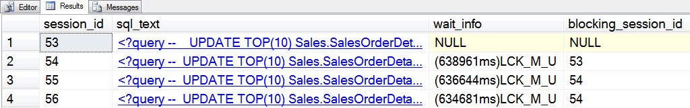
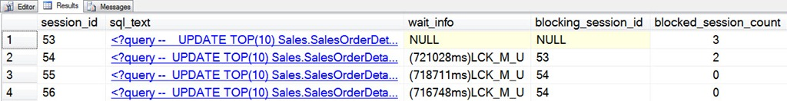

# sp_whoisactive: Leader of the Block

------
[Home](https://github.com/amachanic/sp_whoisactive)	[Download](https://github.com/amachanic/sp_whoisactive/archive/master.zip)	[Documentation Index](ReadMe.md)
------
Prior: [The Key to Your Locks](22_locks.md)	Next: [The Output of Your Dreams](24_output.md)
------

**Oftentimes blocking situations are a bit more complex than one session blocking some other request**. In busy systems *blocking chains* can build up that include dozens or even hundreds of requests, all waiting on one another. And all are waiting as a result of one top-level blocker: the *block leader*. In many cases fixing the blocking problem means fixing whatever it is that the block leader is doing, so identifying it quickly is a key part of debugging blocking situations.

Finding the block leader is a fairly simple process once you realize that **blocking is effectively a hierarchy**. The process involves starting with all of the requests that aren’t blocked and walking down the blocking chain until the leaf level is reached—blockees that lack any more downstream blockees. At each level, a number is recorded to figure out the blocking depth. As an added benefit, a second pass can be made to reverse the number at the end of the process—this shows the total number of downstream blockees for each blocker.

While this is relatively easy to implement using a Common Table Expression, **it’s certainly not something that users should have to reinvent each time it’s needed**. So Who is Active exposes an option, *@find_block_leaders*, that does the work for you. This option adds a new column to the output, called [blocked_session_count], which reflects the total blockee count. Higher numbers mean more sessions blocked downstream; the sessions with the highest numbers are your block leaders, and these are the ones you want to focus on.

To see this in a bit more detail, run the following batch in four sessions:

```sql
USE AdventureWorks
GO

BEGIN TRAN
GO

UPDATE TOP(10) Sales.SalesOrderDetail
SET OrderQty += 7;
GO
```

Assuming that nothing else is running, the first session will complete. The other three will block. Who is Active reports this, of course, even in its default mode:



The initial update was run on session 53, which is blocking session 54. Both 55 and 56 are reported as blocked by 54, although in reality they’re being blocked indirectly by 53. This case, while more complex than most of the blocking examples used in this series, is still simpler than many of the things seen on average production systems. None the less, it’s enough to show the power of the Who is Active option that this post is about...

```sql
EXEC sp_WhoIsActive
  @find_block_leaders = 1
```



The [blocked_session_count] clearly shows which session is causing the issue in this case: 53 has three downstream blockees, whereas 54 has only two, and the other two sessions have none.

In this case, because I happened to run the batches in the correct order, the data is returned by default with the block leader sorted on top. That may or may not always be the case in a real system, but it’s quite a useful thing when there are numerous active requests and you want the most important ones right at the top. To accomplish that, use the output ordering feature—which will be covered in detail in tomorrow’s post.

```sql
EXEC sp_WhoIsActive
  @find_block_leaders = 1,
  @sort_order = '[blocked_session_count] DESC'
```

------
Prior: [The Key to Your Locks](22_locks.md)	Next: [The Output of Your Dreams](24_output.md)
------
