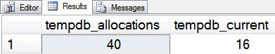
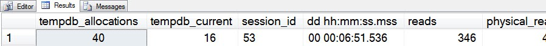
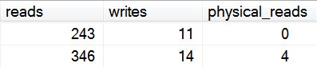

# sp_whoisactive: The Output of Your Dreams

------
[Home](https://github.com/amachanic/sp_whoisactive)	[Download](https://github.com/amachanic/sp_whoisactive/archive/master.zip)	[Documentation Index](ReadMe.md)
------
Prior: [Leader of the Block](23_leader.md)	Next: [Capturing the Output](25_capturing.md)
------

#### Early in the process of creating Who is Active it became clear that there was no way everyone was going to agree.

With each release I received requests to move some column so that it would show up on the lefthand side, or to change the sort order, or to make some other modification that someone felt was necessary to help them more easily digest the data. The problem: it was impossible to accommodate all of these requests. So I decided to go with a self-service model.

In order to allow users to dynamically customize the output (without touching any code), the stored procedure exposes three options: *@output_column_list*, *@sort_order*, and *@format_output*. Each of these is discussed in the following sections.

***@output_column_list*** controls not only whether or not certain columns will be shown in the output, but also the order in which the columns are displayed. The correct argument is a list of bracket-delimited column names (or partial names with wildcards). Delimiters are not necessary (use whatever delimiter you like, or none at all; they’re ignored). The key to successfully using this option is to remember that inclusion of columns in the output is additive: many columns (such as [additional_info]) are only added to the output if both the correct options are enabled for the stored procedure and the columns are included in the column list. If you start modifying the list and don’t take this into account, you may not see the columns you’re expecting when you go back later and start changing options. To keep things flexible, make sure to use wildcard columns, especially a generic wildcard (*[%]*) at the end.

Using the column list can be as simple as specifying the exact columns you’re interested in:

```sql
EXEC sp_WhoIsActive
  @output_column_list = '[tempdb_allocations][tempdb_current]'
```

Notice that no delimiter is used here. Again, any extraneous text aside from the column specifiers is ignored, so the following call is equivalent:

```sql
EXEC sp_WhoIsActive
  @output_column_list = 'this[tempdb_allocations]is[tempdb_current]ignored'
```

Easier than specifying exact column names is to use wildcards that match the pattern of the columns you’re interested in:

```sql
EXEC sp_WhoIsActive
  @output_column_list = '[tempdb%]'
```

All three of these calls will yield the same output, similar to the following:



Of course, this will return *only* these two columns. Generally I’ll use the column list feature just to move things around so that I don’t have to do as much scrolling, and in those cases I almost always want everything else, too. That’s where the generic wildcard comes into play:

```sql
EXEC sp_WhoIsActive
  @output_column_list = '[tempdb%][%]'
```



Now the *tempdb*-specific columns appear on the lefthand side, and all of the other columns follow, in a default order.

**The next option we’ll cover is *@sort_order***. This option controls the order of the rows output by the stored procedure. Like *@output_column_list*, the input is a list of bracket-delimited column names. In this case, wildcards are not supported, but the keywords *ASC*[ENDING] and *DESC*[ENDING] are supported after the column name.

The following call returns data sorted by [login_name] ascending (ascending is default, so the keyword is optional), with ties broken by [session_id] descending:

```sql
EXEC sp_WhoIsActive
  @sort_order = '[login_name][session_id] DESC'
```

As before, delimiters are optional and are ignored. Please note that the current betas of Who is Active have bug where multi-column sorts like this one are not properly honored. That issue will be fixed in the next version of Who is Active.

Sorting is especially useful when doing any kind of comparison of the various requests currently running. I use it extensively in block leader mode ([blocked_session_count] DESC), and it is quite handy in delta mode—which will be covered in a post in a few days.

**The final option this post will cover is *@format_output***. This one is based on the fact that Who is Active is designed to leverage SSMS as a “graphical user interface” of sorts. Query text is sent back in an XML format, numbers are formatted as right-justified strings, and elapsed time is formatted in the more easily-digestible [dd hh:mm:ss.mss] form.

If you’ve been using Who is Active for a while you’ve probably noticed the right-justified numbers:



This format was suggested fairly early on by Aaron Bertrand, and is one of my favorite things about the stored procedure. It makes it much easier to pick out bigger numbers when you’re looking at a large set of data. By default, SSMS uses a non-fixed width font for grid results, so the default argument to *@format_output,* **1**, takes this into consideration. But some people—like Aaron Bertrand—change the SSMS settings and use a fixed width font instead. If you’re one of these people you can use an argument of **2** to get nicely-formatted numbers. If you don’t change the argument you might notice that the numbers don’t seem to properly line up when you’re working with a set of data containing numbers of greatly differing size.

Still other people don’t like the right-justified numbers or are doing collection to a table (see tomorrow's post), and so formatting can be completely disabled by using an argument of **0**. It’s up to you...

------
Prior: [Leader of the Block](23_leader.md)	Next: [Capturing the Output](25_capturing.md)
------
