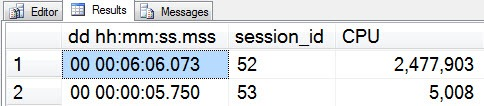
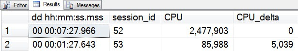

# sp_whoisactive: Delta Force

------
[Home](https://github.com/amachanic/sp_whoisactive)	[Download](https://github.com/amachanic/sp_whoisactive/archive/master.zip)	[Documentation Index](ReadMe.md)
------
Prior: [Capturing the Output](25_capturing.md)	Next: [Who is Active's Hidden Gems](27_gems.md)
------

The CPU is pegged. Your hard disks are fried. Memory consumption is through the roof. **Who is to blame?!?**

Well that’s easy. Blame the session with the most CPU consumption. Blame the session doing the most I/O operations. Ask Who is Active what’s going on—it’ll tell you...



*Clearly* session 52 is the problem here. It’s consumed over 2,000,000 milliseconds of CPU time. Session 53, on the other hand, has consumed a paltry five seconds. No brainer, right?

**Except that it’s not**.

Session 52? It’s in a wait state. (WAITFOR, to be exact.) Not consuming any CPU time at all at the time I ran Who is Active. Session 53? Using plenty. So why the discrepancy? Does Who is Active have a major bug?

The fact is—and this will be obvious to a lot of you, so forgive me—most of the metrics reported by Who is Active are *cumulative*. They’re totals from the entire session, or the entire lifetime of the request (depending on what’s going on). In the case of session 52 in the image above, that much CPU time was consumed over a five-minute period *prior* to the point in time when I ran Who is Active. Session 53, on the other hand, is *currently* consuming CPU time. But how do I figure that out?

**The answer: delta mode.** This feature is something for which you can thank Jimmy May, who kept telling me about his “SQL Deltoids” script that he’d written back in the bad old days of SQL Server 2000. “If only there were a way to apply that script to the SQL Server 2005 DMVs,” he lamented one day. So I added the functionality into Who is Active. It’s quite simple, and surprisingly effective.

To use delta mode, simply invoke Who is Active’s *@delta_interval* option. Setting an interval will cause the procedure to execute its main logic branch, then wait the specified amount of time—a number of seconds between 1 and 255—before running the same main logic branch again. All of the numeric values that changed during that period will be compared, and the changed numbers will be output in a series of columns named with *_delta* at the end.

For example, here are the same two sessions as above, viewed in delta mode:

```sql
 EXEC sp_WhoIsActive
   @delta_interval = 5
```



During the five-second delta interval, session 52 consumed no CPU time. Session 53, on the other hand, consumed over 5,000 milliseconds of time. If the CPU is pegged, 52 is no longer contributing—53 is the session of interest.

Enabling delta mode will add some or all of the following columns to the output, depending on what other options have been set:

- physical_io_delta
- reads_delta
- physical_reads_delta
- writes_delta
- tempdb_allocations_delta
- tempdb_current_delta
- CPU_delta
- context_switches_delta
- used_memory_delta

By leveraging these delta columns in conjunction with the *@sort_order* option, it’s easy to quickly see which sessions are *currently* consuming your valuable server resources—which is generally more interesting than seeing which sessions may have been consuming resources but are now waiting or sleeping.

Note: The various sessions and requests you'll see in delta mode pertain to the information captured after the wait interval. Information about requests that were running as of the first collection but are not running as of the second is discarded. New requests that started after the first collection will be shown, but with delta values of NULL. Locks, transactions, and other optional information, will also be captured only for the second collection, since no delta calculation is possible for those metrics (at least, not yet).

------
Prior: [Capturing the Output](25_capturing.md)	Next: [Who is Active's Hidden Gems](27_gems.md)
------
